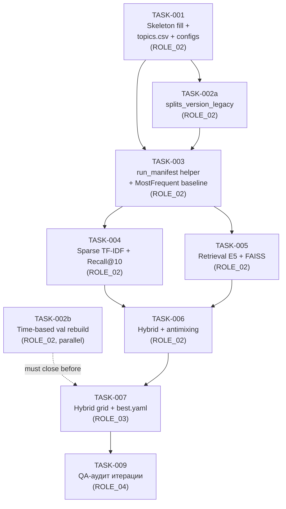
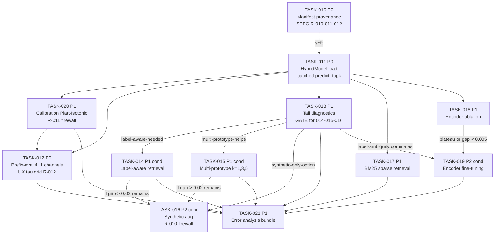
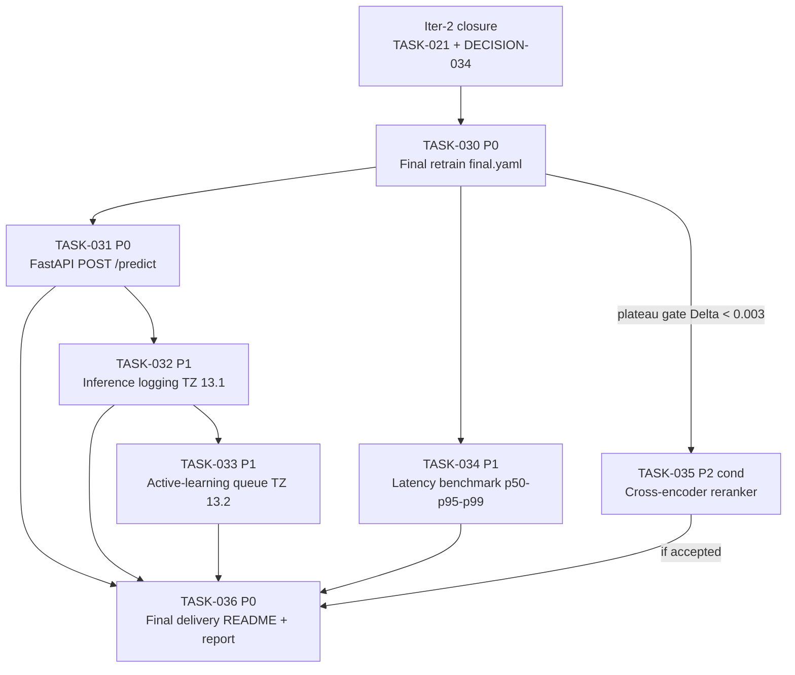

# Implementation Plan — Iteration 1 (MVP-baseline → best.yaml)

> **Owner:** ROLE_01 (Architect/Researcher/Reviewer).
> **Created:** 2026-04-26.
> **Authoritative sources:** [`ai_docs/SPEC.md`](../ai_docs/SPEC.md),
> [`TASK_QUEUE.md`](../TASK_QUEUE.md),
> [`ai_docs/architecture_init_report.md`](../ai_docs/architecture_init_report.md),
> [`ai_docs/current_development_state.md`](../ai_docs/current_development_state.md),
> [`ai_docs/technical_assignment_from_scratch.md`](../ai_docs/technical_assignment_from_scratch.md).
>
> Этот документ — **исполнительский** (для ROLE_02/03/04). Контракт лежит
> в SPEC.md; план только упорядочивает работу первой итерации и пере-
> форматирует существующие карточки `TASK_QUEUE.md` для удобства чтения.

---

## 5.1. Текущая точка старта

Архитектурная инициализация завершена (см.
[`architecture_init_report.md`](../ai_docs/architecture_init_report.md)
§10 «Pre-flight closure»). SPEC.md канонизирован (803 строки, §3 — структура
репо, §4.1 — канонические колонки `text, topic_id, created_at`, §4.5 —
формат `metrics.json`, §4.6 — manifest, §6.5 — антимиксинг, §6.6 — FAISS-инвариант,
§13 — глоссарий рисков **R-001…R-009**). DECISION-2026-04-25-001…
2026-04-26-015 зафиксированы в `TASK_QUEUE.md`. Skeleton `src/`
физически создан (`src/{__init__.py, data/, models/, eval/, utils/, cli/, _legacy/}`),
44 legacy-файла перемещены в `src/_legacy/` (frozen read-only). Шаблоны
manifest лежат в `.ai/templates/run_manifest.{template,example}.json`.
Cursor-окружение: 8 правил `.cursor/rules/*.mdc`, 6 skills
`.cursor/skills/<name>/SKILL.md`. Legacy reference baseline — Recall@5 ≈
**0.7780** на `experiments/e02_faiss_plus_e01_all` (SPEC §5.5; не
пересчитывается). Блокеров от архитектора больше нет — все они закрыты
или переведены в обычные TASK-* (см. §6.2 архитектурного отчёта).

---

## 5.2. Цель первой итерации (проверяемая)

К концу итерации в репозитории должно быть **минимум 3 обученных
модели** (MostFrequent baseline + sparse TF-IDF + dense E5 retrieval +
hybrid sparse+dense), каждая со своим `run_id`, изолированными
артефактами в `artifacts/<family>/<run_id>/`, валидным `manifest.json`
по SPEC §4.6 и `metrics.json` по SPEC §4.5 — **с обязательным
Recall@10** на time-based `test`. Hybrid должен пройти grid по
λ × candidates × norm и дать `configs/best.yaml` + `reports/decision_note.md`.
Итерация считается завершённой, когда ROLE_04 закрывает аудит без
Blocker/Major issue (см. §5.5).

**Out of scope первой итерации** (отложено на следующие итерации):

- TASK-008 (prefix-симуляция и порог τ) — P1 по ТЗ §10, не блокирует
  выбор `best.yaml`. Включается во вторую итерацию.
- Cross-encoder / E03 (P2, DECISION-005).
- Head-only / tail-fallback / calibration / multi-prototype (Backlog
  `TASK_QUEUE.md`).

---

## 5.3. Последовательность задач



**Линейный порядок исполнения** (с явной фиксацией параллельных веток):

1. **TASK-001** (ROLE_02) — наполнить skeleton, `topics.csv`, конфиги.
2. **TASK-002a** (ROLE_02) — `splits_version_legacy` helper. Может стартовать
   параллельно с поздней частью TASK-001 (после `src/data/__init__.py`),
   но в практике быстрее завершить TASK-001 целиком.
3. **TASK-003** (ROLE_02) — `run_manifest.py` helper + MostFrequent baseline
   (это первый «настоящий» run, проверяющий весь pipeline артефактов).
4. **TASK-002b** (ROLE_02, **параллельная ветка**) — пересборка val в
   time-based. Может выполняться параллельно с TASK-004…TASK-006 на
   любой свободной CPU-машине; **обязана закрыться ДО TASK-007**.
5. **TASK-004** (ROLE_02) — Sparse TF-IDF + LogReg/LinearSVC + Recall@10.
6. **TASK-005** (ROLE_02) — Retrieval E5 (centroids) + FAISS-инвариант.
7. **TASK-006** (ROLE_02) — Hybrid sparse+dense + антимиксинг-диагностики.
8. **TASK-007** (ROLE_03) — Hybrid grid + `best.yaml` + `decision_note.md`.
9. **TASK-009** (ROLE_04) — QA-аудит всей серии.

---

## 5.4. Карточки задач

> Источник истины — `TASK_QUEUE.md`. Здесь — компактная развёртка для
> исполнителя. Все пути даны от корня репо (`e:/Python/orLLM`).

### TASK-001 — Skeleton fill + topics.csv + configs

| Поле | Значение |
|---|---|
| **ID** | TASK-001 |
| **Owner** | ROLE_02 |
| **Что сделать** | Наполнить уже созданный skeleton `src/{data,models,eval,utils,cli}/` stub-сигнатурами по SPEC §5; реализовать `src/data/build_topics.py` (алгоритм SPEC §4.2.1, DECISION-010); создать набор YAML-конфигов; создать `data/processed/topics.csv` (UTF-8). |
| **Inputs** | `data/interim/clean.csv` (canonical themes), `configs/taxonomy.yaml` (alias dict), skeleton `src/`, SPEC §4.1, §4.2.1, §4.4, §5, §10. |
| **Outputs / артефакты** | `src/{data,models,eval,utils,cli}/*.py` (stubs + рабочий `build_topics.py` + `cli/__init__.py` диспетчер); `configs/{data,sparse,retrieval,hybrid,prefix}.yaml`; `data/processed/topics.csv` (`topic_id,topic_name,count_total`); `reports/eda/topics_summary.json` (`taxonomy_version`, `n_topics`, `n_aliases_applied`); `docs/experiment_protocol.md` (черновик); `tests/test_{topics,metrics,split}.py` (smoke). |
| **Acceptance** | `python -m src.cli --help` перечисляет команды SPEC §10; `build-topics` детерминирован (одинаковый SHA256 при повторном запуске); `taxonomy_version = sha256(\n.join(sorted(unique_norm)))` совпадает с независимым расчётом в `tests/test_topics.py`; ≥ 200 уникальных строк в `topics.csv`; `pytest tests/ -q` зелёный; **никаких записей в `exp/**` в активном коде (R-008, scope per DECISION-017): `rg -l "['\"](\\./)?exp/" src/ configs/ data/processed/ reports/ tests/ -g "!src/_legacy/**"` → пусто**; **никаких импортов из `src/_legacy`**; PEP 8/ruff чистый. |
| **Зависит от** | — (входная задача итерации) |
| **Метрики на выходе** | Не считаются (data-prep задача). Только `taxonomy_version` и `n_topics`. |

### TASK-002a — splits_version_legacy

| Поле | Значение |
|---|---|
| **ID** | TASK-002a |
| **Owner** | ROLE_02 |
| **Что сделать** | Реализовать `src/data/splits_version.py` (или функцию в `src/models/io.py`), которая считает SHA256 каждого parquet-файла и возвращает агрегированный `splits_version` + флаг `splits_legacy_random_val: true` для записи в manifest всех runов TASK-003…TASK-006. |
| **Inputs** | `data/splits/{train,val,test}.parquet`. |
| **Outputs / артефакты** | `src/data/splits_version.py`; `reports/split/splits_version_legacy.json`. |
| **Acceptance** | Helper интегрируется в `build_manifest` (TASK-003); идемпотентный SHA256; флаг `splits_legacy_random_val: true` присутствует в manifest всех runов до TASK-002b; никаких записей в `exp/**` (R-008). |
| **Зависит от** | TASK-001 (skeleton + `src/data/__init__.py`). |
| **Метрики на выходе** | — (utility task). |

### TASK-003 — run_manifest helper + MostFrequent baseline

| Поле | Значение |
|---|---|
| **ID** | TASK-003 |
| **Owner** | ROLE_02 |
| **Что сделать** | (1) Реализовать `src/utils/run_manifest.py` строго по сигнатуре из `.cursor/skills/run-manifest-builder/SKILL.md` («Helper signature (TASK-003 contract)») и DECISION-015. (2) Реализовать `src/models/baseline_most_frequent.py` + CLI `train-baseline-most-frequent` + `eval`. Сохранить manifest, classes.json, predictions.parquet, `metrics.json`. |
| **Inputs** | `configs/baseline.yaml` (или `configs/sparse.yaml` с `classifier: most_frequent`), `data/splits/*.parquet`, `data/processed/topics.csv` (TASK-001), `splits_version` helper (TASK-002a), `.ai/templates/run_manifest.{template,example}.json`. |
| **Outputs / артефакты** | `src/utils/run_manifest.py`; `tests/test_run_manifest.py`; `artifacts/baseline_most_frequent/<run_id>/{model.pkl,classes.json,predictions.parquet}`; `artifacts/manifests/<run_id>.json`; `reports/runs/<run_id>/metrics.json`. |
| **Acceptance** | `metrics.json` валиден по SPEC §4.5 (включая `head_mid_tail` practical+strict); manifest валиден по SPEC §4.6 и шаблону; `splits_legacy_random_val: true` присутствует; `taxonomy_version` совпадает с TASK-001; **Recall@10 рассчитан**; `write_manifest("...","exp/...")` поднимает `ValueError` (тест); reproducible; никаких записей в `exp/**` (R-008). |
| **Зависит от** | TASK-001, TASK-002a. |
| **Метрики на выходе** | Recall@1/3/5/10 (нижняя граница), Macro-F1, head/mid/tail (оба режима), latency_ms, MRR@10, nDCG@10. |

### TASK-002b — Time-based val rebuild (параллельная ветка)

| Поле | Значение |
|---|---|
| **ID** | TASK-002b |
| **Owner** | ROLE_02 |
| **Что сделать** | Реализовать честный time-based split в `src/data/split.py` (R-009): test = последние 2 мес, val = окно ПЕРЕД test, train = всё ранее val. Канонические колонки `text, topic_id, created_at`. Сохранить `split_report.json/.md` с обеими версиями head/mid/tail. |
| **Inputs** | `data/interim/clean.csv`, `configs/data.yaml`, `data/processed/topics.csv` (TASK-001). |
| **Outputs / артефакты** | `data/splits/{train,val,test}.parquet` (перезапись legacy); `reports/split/split_report.{json,md}`; `reports/split/splits_version.json` (новый, без legacy-маркера); `src/data/split.py`. |
| **Acceptance** | `train.created_at.max() < val.created_at.min() < val.created_at.max() < test.created_at.min()`; нет пересечения по `text`; колонки канон; `taxonomy_version` совпадает с TASK-001; split_report содержит practical+strict; `tests/test_split.py` зелёный; manifest всех последующих runов НЕ содержит `splits_legacy_random_val`; никаких записей в `exp/**` (R-008). |
| **Зависит от** | TASK-001 (`topics.csv`, `configs/data.yaml`). |
| **Метрики на выходе** | Размеры train/val/test, `n_unseen_classes_in_val`, `n_unseen_classes_in_test`. |
| **Жёсткий дедлайн** | **Должна закрыться ДО TASK-007** (best.yaml не выбирается на legacy-сплите). |

### TASK-004 — Sparse TF-IDF baseline

| Поле | Значение |
|---|---|
| **ID** | TASK-004 |
| **Owner** | ROLE_02 |
| **Что сделать** | Реализовать `src/models/sparse.py` (train + predict) + CLI `train-sparse`. Поддержать `classifier ∈ {logreg, linsvc, calibrated_linsvc, sgd}`, `vectorizer ∈ {tfidf, hashing}`, ngram_range/min_df/max_features/C/class_weight по `configs/sparse.yaml`. |
| **Inputs** | `data/splits/*.parquet`, `configs/sparse.yaml`, `data/processed/topics.csv`. |
| **Outputs / артефакты** | `artifacts/sparse/<run_id>/{model.pkl,vectorizer.pkl,classes.json,predictions.parquet}`; `artifacts/manifests/<run_id>.json`; `reports/runs/<run_id>/metrics.json`. |
| **Acceptance** | **Recall@10 ≥ 0.65** на test (sanity нижняя граница); `predict_topk` возвращает только `topic_id` из `topics.csv`; manifest содержит `data_version` хеши и `taxonomy_version`; `tests/test_inference.py` зелёный; никаких записей в `exp/**`. |
| **Зависит от** | TASK-003 (run_manifest helper). |
| **Метрики на выходе** | Recall@1/3/5/10, Macro-F1, Weighted-F1, Accuracy@1, head/mid/tail (practical+strict), MRR@10, nDCG@10, latency_ms. |

### TASK-005 — Retrieval E5 + FAISS-инвариант

| Поле | Значение |
|---|---|
| **ID** | TASK-005 |
| **Owner** | ROLE_02 |
| **Что сделать** | Реализовать `src/models/retrieval.py` (centroids; опц. label / label_plus_centroid / document_knn) + CLI `train-retrieval`. Энкодер по умолчанию — `intfloat/multilingual-e5-base`. Сохранить `meta.json` индекса со всеми 7 ключами skill `faiss-normalization-check`. |
| **Inputs** | `data/splits/train.parquet`, `data/processed/topics.csv`, `configs/retrieval.yaml`. |
| **Outputs / артефакты** | `artifacts/retrieval/<run_id>/{themes.faiss,classes.json,meta.json,embeddings.npy}`; `artifacts/manifests/<run_id>.json` с `retrieval_meta`; `reports/runs/<run_id>/metrics.json`. |
| **Acceptance** | `meta.json` валиден (skill); `index.ntotal == len(classes)`; eval применяет `normalize_embeddings` ИЗ `meta.json`, а не из CLI (R-001); FAISS читается через `faiss.read_index(str(path))` (R-005); **Recall@10 (centroids-only) ≥ 0.55** на test; никаких записей в `exp/**`. |
| **Зависит от** | TASK-003. |
| **Метрики на выходе** | Recall@1/3/5/10, Macro-F1, head/mid/tail (оба), latency_ms (encode + search), `recall_in_candidates@N`. |

### TASK-006 — Hybrid sparse+dense + антимиксинг

| Поле | Значение |
|---|---|
| **ID** | TASK-006 |
| **Owner** | ROLE_02 |
| **Что сделать** | Реализовать `src/models/hybrid.py` с fusion ∈ {weighted_score, rrf}, norm ∈ {minmax, zscore, softmax, rank}, per_query. Применить skill `hybrid-signal-mixing-check`. Записать `hybrid_diagnostics` (Pearson, top-1 change rate, Recall@10 при λ=0/0.5/1) в `metrics.json`. |
| **Inputs** | артефакты TASK-004 (`classes.json` sparse) и TASK-005 (`classes.json` retrieval), `configs/hybrid.yaml`. |
| **Outputs / артефакты** | `artifacts/hybrid/<run_id>/fusion_config.json`; `artifacts/manifests/<run_id>.json`; `reports/runs/<run_id>/metrics.json` с `hybrid_diagnostics`. |
| **Acceptance** | `assert classes_sparse == classes_retrieval` (R-004); **Recall@10 на test строго > max(sparse, retrieval)** на лучшем `λ`; **top-1 change rate (λ=0 → λ=1) ≥ 5%** (R-003); Pearson(sparse, dense) на val записан; никаких записей в `exp/**`. |
| **Зависит от** | TASK-004, TASK-005. |
| **Метрики на выходе** | Recall@1/3/5/10, Macro-F1, head/mid/tail, hybrid_diagnostics. |

### TASK-007 — Hybrid grid + best.yaml ✅ DONE

| Поле | Значение |
|---|---|
| **ID** | TASK-007 |
| **Owner** | ROLE_03 |
| **Status** | DONE 2026-04-27 (DECISION-029) |
| **Что сделано** | Grid 4×3 (candidates × norm) с 8-точечным calibrate_lambda_grid внутри (12 train-hybrid runs). Победитель по **val-first** (anti-R-007). |
| **Inputs** | sparse_v2 + retrieval_v2 (DECISION-028). |
| **Outputs / артефакты** | `tools/grid_hybrid.py`; 12 × `reports/runs/<run_id>/metrics.json` + manifest; `configs/best.yaml` (sha256 `f6f88b7b…`); `reports/grid/hybrid_grid.csv` (sha256 `0630dbda…`); `reports/grid/hybrid_grid_summary.md`. |
| **Best config** | N=30, norm=minmax, λ=0.14 → **R@10_val=0.81759**, R@10_test=0.81611. Run `20260427_171719_hybrid_weighted_score_minmax`. |
| **Acceptance (factual)** | 12 runs PASS sanity λ=0/1; norm=minmax доминирует Δ≈0.005 (5σ); latency p50=1.4ms, p95=2.3ms; 38/38 тестов; R-008 чист; 16.1 min wall time. |
| **Зависит от** | TASK-006a, TASK-002b (hard dependency, выполнено). |

### TASK-009 — QA-аудит первой полной серии ✅ DONE

| Поле | Значение |
|---|---|
| **ID** | TASK-009 |
| **Owner** | ROLE_04 |
| **Status** | DONE 2026-04-27 (DECISION-030, ITERATION CLOSED) |
| **Что сделано** | Все 10 групп проверок (A-J) выполнены: anti-leakage, FAISS-инвариант, антимиксинг, изоляция, согласованность классов, reproducibility, eval-pipeline carry-over, sanity examples, кодировка, метрики monotonicity. Создана QA-инфраструктура `tools/qa_*.py`. |
| **Inputs** | 5 runs в leaderboard, configs/{baseline,sparse,retrieval,hybrid,best}.yaml. |
| **Outputs** | `docs/audit_report.md` (sha `06dbf02e…`); `reports/leakage_checks.json` (`ce02874a…`); `reports/metric_sanity_checks.json` (`72ff0ab4…`); `reports/sanity_examples.json` (`d52603e4…`); `reports/eval_pipeline_check.json` (`2b7377e5…`); `tools/qa_active_checks.py`, `tools/qa_sanity_examples.py`. |
| **Verdict** | **0 Blocker, 0 Major, 2 Minor** (AUD-01, AUD-02 — technical debt iter 2). best.yaml R@10 = 0.8161153519932146 bit-exact (|Δ|=0). 5/5 eval-pipeline carry-over PASS (Δ=0 все). Sanity examples: 9/10 true-in-top10 = 90% (Wilson CI на n=10 [49%, 96%], population R@10≈81.6%). 38/38 тестов. |
| **Зависит от** | TASK-007 (выполнено). |

---

## 5.5. Definition of Done первой итерации

ROLE_04 закрывает итерацию по этому чек-листу:

- [ ] **Skeleton наполнен**: `src/{data,models,eval,utils,cli}/` содержит
      реализации (не только stub'ы) для baseline+sparse+retrieval+hybrid;
      `src/_legacy/` — нетронут.
- [ ] **`data/processed/topics.csv` детерминирован** (одинаковый SHA256
      при повторном запуске; ≥ 200 уникальных тем).
- [ ] **Сплиты пересобраны time-based** (TASK-002b закрыт), manifest всех
      финальных runов НЕ содержит `splits_legacy_random_val`.
- [ ] **≥ 3 моделей с Recall@10**: MostFrequent baseline (TASK-003),
      Sparse (TASK-004), Retrieval (TASK-005), Hybrid (TASK-006). Все —
      на time-based test (после TASK-002b).
- [ ] **Каждый run изолирован**: `artifacts/<family>/<run_id>/` с
      manifest по SPEC §4.6 и `metrics.json` по SPEC §4.5.
- [ ] **`metrics.json` содержит обе версии head/mid/tail** (practical и
      strict; DECISION-009).
- [ ] **`taxonomy_version` и `splits_version` зафиксированы** в каждом
      manifest и `metrics.json`.
- [ ] **Антимиксинг подтверждён**: для hybrid Pearson(sparse, dense) и
      top-1 change rate (λ=0 → λ=1 ≥ 5%) записаны (R-003).
- [ ] **FAISS-инвариант подтверждён**: `meta.json` содержит все 7
      ключей; eval использует `normalize_embeddings` из `meta.json`
      (R-001/R-005).
- [ ] **`configs/best.yaml` выбран** по правилу SPEC §9 и обоснован в
      `reports/decision_note.md`.
- [ ] **`reports/leaderboard.csv` ≥ 60 строк** с полем Recall@10.
- [ ] **Никаких записей в `exp/**`** (R-008) — проверено
      `rg "['\"](\\./)?exp/" artifacts/ reports/ configs/best.yaml` (пусто).
- [ ] **QA-отчёт `docs/audit_report.md` сдан**, 0 Blocker, 0 Major.
- [ ] **Воспроизводимость**: повторный запуск `best.yaml` даёт
      идентичные метрики (CPU ± 1e-3 / GPU ± 1e-2).

---

## 5.6. Риски итерации (топ-5)

| Риск    | Где сработает      | Митигация                                                                                  |
|---------|--------------------|--------------------------------------------------------------------------------------------|
| **R-002 / R-008** Запись в legacy `exp/**` или общий каталог | TASK-003…TASK-007 | Pre-write check `assert_writable(path)` (rule 20), `write_manifest` ValueError на `exp/**` (TASK-003), QA-grep в TASK-009 |
| **R-001 / R-005** Несогласованная нормализация / неправильное чтение FAISS | TASK-005, TASK-006 | Skill `faiss-normalization-check`: `meta.json` со всеми 7 ключами, eval читает `normalize_embeddings` из meta; `faiss.read_index(str(path))` |
| **R-003** Смешивание одного и того же сигнала (hybrid) | TASK-006, TASK-007 | Skill `hybrid-signal-mixing-check`: Pearson + top-1 change rate в `metrics.json`; acceptance `change rate ≥ 5%` |
| **R-004** Несоответствие классов sparse и dense | TASK-006 | Один источник истины `topics.csv` (TASK-001); `assert classes_sparse == classes_retrieval`; единый `taxonomy_version` |
| **R-009** Random-stratified val в legacy сплитах | TASK-002a → TASK-002b | TASK-002a маркирует runы `splits_legacy_random_val: true`; TASK-002b пересобирает val time-based; TASK-007 не стартует, пока TASK-002b не закрыт |

Дополнительно учтены, но менее вероятны на этой итерации: R-006
(`sys.executable` в гридах ROLE_03), R-007 (UTF-8 — все файлы пишутся
через `encoding="utf-8"`).

---

## 6. Стартовый пакет для ROLE_02

### 6.1. Очередь старта

ROLE_02 берёт задачи **в этом порядке**, без перескакивания:

1. **TASK-001** — skeleton fill + topics.csv + configs (входная задача,
   без неё ничего не запустится).
2. **TASK-002a** — splits_version_legacy helper. Маленький, но
   критический: его результат импортируется в TASK-003.
3. **TASK-003** — `run_manifest.py` helper + MostFrequent baseline
   (первый «настоящий» run, проверка всего pipeline артефактов).

> Дальше: после TASK-003 ROLE_02 идёт по TASK-004 → TASK-005 →
> TASK-006. **Параллельно** (на свободной CPU-машине) ROLE_02 запускает
> TASK-002b — её результат нужен ROLE_03 в TASK-007.

### 6.2. Готовый промпт-блок для запуска ROLE_02 на TASK-001

> Скопируйте этот блок целиком как первое сообщение ROLE_02. Промпт
> самодостаточен: содержит ссылки на источники правды, точный список
> файлов, acceptance criteria и run-команды.

```
Ты — ROLE_02 (ML Engineer / Developer). Корень проекта: e:/Python/orLLM
(Windows, PowerShell). Перед началом работы — обязательное чтение:

ОБЯЗАТЕЛЬНЫЕ ИСТОЧНИКИ ПРАВДЫ (в этом порядке):
1) .cursor/agents/ROLE_02_ML_ENGINEER_DEVELOPER.md — твоя роль.
2) ai_docs/SPEC.md — целиком §3 (структура repo), §4.1 (колонки
   text/topic_id/created_at), §4.2 (taxonomy + §4.2.1 алгоритм
   topics.csv + §4.2.2 taxonomy_version), §4.4 (configs),
   §5 (сигнатуры — стаб-контракт для модулей), §10 (CLI команды),
   §13 (R-001…R-009).
3) ai_docs/current_development_state.md — §0 «Snapshot» и §5 (история
   ошибок, маппинг на R-001…R-009).
4) TASK_QUEUE.md — карточка TASK-001 целиком (DECISION-2026-04-26-014
   — что skeleton УЖЕ создан, нельзя пересоздавать).
5) docs/implementation_plan.md §5.4 «TASK-001» (этот документ) — для
   удобной развёртки acceptance.
6) .cursor/skills/recall-at-k-validator/SKILL.md (для понимания формата
   metrics, хотя сам метрик не считаешь в TASK-001).
7) .cursor/skills/time-based-split-validator/SKILL.md (для будущих
   задач, ознакомиться).

ЗАДАЧА — TASK-001:
Наполнить уже созданный skeleton src/{data,models,eval,utils,cli}/
stub-сигнатурами по SPEC §5 и реализовать первый рабочий модуль
src/data/build_topics.py (детерминированное построение topics.csv по
алгоритму SPEC §4.2.1, DECISION-2026-04-25-010).

ЗАПРЕЩЕНО:
- пересоздавать или переименовывать каталоги skeleton (они уже есть);
- импортировать что-либо из src/_legacy/ в новый код;
- писать что-либо в exp/** (R-008, DECISION-2026-04-25-011);
- использовать random shuffle в любом split-коде;
- использовать общие имена файлов без изоляции по run_id (но в
  TASK-001 артефакты run-ов ещё не создаются).

ФАЙЛЫ ДЛЯ СОЗДАНИЯ/ИЗМЕНЕНИЯ (точный список):

src/data/:
  - build_topics.py        (РАБОЧАЯ реализация SPEC §4.2.1)
  - prepare.py             (stub-сигнатуры под SPEC §5)
  - split.py               (stub; реализация — TASK-002b)
  - splits_version.py      (stub; реализация — TASK-002a)

src/models/:
  - baseline_most_frequent.py  (stub; реализация — TASK-003)
  - sparse.py                  (stub; реализация — TASK-004)
  - retrieval.py               (stub; реализация — TASK-005)
  - hybrid.py                  (stub; реализация — TASK-006)
  - io.py                      (stub: load/save artifacts helpers)

src/eval/:
  - metrics.py        (stub: recall_at_k, macro/weighted F1,
                       accuracy_at_1, mrr_at_10, ndcg_at_10 — сигнатуры)
  - slices.py         (stub: head/mid/tail practical+strict — сигнатуры)
  - prefix_eval.py    (stub; реализация — TASK-008)

src/utils/:
  - seed.py            (stub: set_seed(42))
  - logging.py         (stub: get_logger)
  - encoding.py        (stub: UTF-8 helpers; см. R-007)
  - paths.py           (stub: ensure_writable_path → запрет на exp/)
  - run_manifest.py    (stub; полная реализация — TASK-003 по
                        контракту .cursor/skills/run-manifest-builder/SKILL.md)

src/cli/:
  - __init__.py        (argparse-диспетчер для всех команд SPEC §10)
  - prepare_data.py
  - build_topics.py             (РАБОЧАЯ команда — единственная в TASK-001)
  - splits_version.py
  - train_baseline.py
  - train_sparse.py
  - train_retrieval.py
  - train_hybrid.py
  - evaluate.py
  - prefix_eval.py
  - build_manifest.py

configs/:
  - data.yaml       (по SPEC §4.4: paths, columns, normalization,
                     taxonomy.aliases_path, eval.head_mid_tail.mode:
                     practical, head_min: 50, mid_min: 10 — DECISION-009)
  - sparse.yaml     (TF-IDF + classifier; черновик, без значений-плейсхолдеров)
  - retrieval.yaml  (model_name: intfloat/multilingual-e5-base,
                     normalize_embeddings: true, faiss_metric: IP)
  - hybrid.yaml     (fusion: weighted_score, lambda grid placeholder,
                     candidates grid placeholder, norm: minmax)
  - prefix.yaml     (placeholder для TASK-008; thresholds [10,20,30,50,100])

data/processed/:
  - topics.csv      (UTF-8, колонки: topic_id,topic_name,count_total)

reports/eda/:
  - topics_summary.json  ({"taxonomy_version":"...", "n_topics":...,
                            "n_aliases_applied":...})

docs/:
  - experiment_protocol.md  (черновик: copy-paste из SPEC §6 и §11
                              + ссылки на R-001…R-009)

tests/:
  - test_topics.py   (smoke: count ≥ 200, taxonomy_version совпадает,
                      повторный build даёт тот же SHA256 файла)
  - test_metrics.py  (smoke на stub-сигнатурах; реальные тесты — TASK-004+)
  - test_split.py    (smoke на stub; реальные тесты — TASK-002b)

АЛГОРИТМ build_topics.py (SPEC §4.2.1, DECISION-010):
  1) df = pd.read_csv("data/interim/clean.csv", encoding="utf-8")
  2) raw = df["тема"].dropna().astype(str)   # legacy column name; см. configs/data.yaml
  3) aliases = yaml.safe_load(open("configs/taxonomy.yaml"))["aliases"]
     (alias-словарь {alias_str: canonical_str})
  4) def norm(s): return re.sub(r"\s+", " ", s.strip().lower().replace("ё","е"))
  5) themes_norm = [aliases.get(norm(s), norm(s)) for s in raw]
  6) unique = sorted(set(themes_norm))
  7) topic_id = sha1(name.encode("utf-8")).hexdigest()[:8]
  8) count_total = Counter(themes_norm)
  9) сохранить topics.csv (UTF-8, lineterminator="\n") детерминированно.
  10) taxonomy_version = "sha256:" + sha256("\n".join(unique)).hexdigest()
  11) записать reports/eda/topics_summary.json со statистикой.

CLI ДИСПЕТЧЕР (src/cli/__init__.py):
  python -m src.cli --help                      # список команд
  python -m src.cli build-topics --config configs/data.yaml
  python -m src.cli prepare-data --config ...   # stub
  python -m src.cli splits-version --paths ...  # stub
  python -m src.cli train-baseline --config ... # stub
  ... (см. SPEC §10)

ACCEPTANCE CRITERIA (must all pass):
  [ ] python -m src.cli --help выводит все 11 команд SPEC §10.
  [ ] python -m src.cli build-topics --config configs/data.yaml
      создаёт data/processed/topics.csv детерминированно
      (повторный запуск даёт идентичный SHA256 файла).
  [ ] taxonomy_version в reports/eda/topics_summary.json совпадает с
      независимым расчётом в tests/test_topics.py.
  [ ] data/processed/topics.csv содержит ≥ 200 уникальных строк
      (реальное значение ожидается ≈ 302).
  [ ] python -m pytest tests/ -q проходит без ошибок.
  [ ] Линтер (PEP 8 / ruff) не выдаёт ошибок на новых файлах.
  [ ] Все configs/{data,sparse,retrieval,hybrid,prefix}.yaml загружаются
      yaml.safe_load без исключений.
  [ ] rg "from src\._legacy" src/  → пусто.
  [ ] rg -l "['\"](\\./)?exp/" src/ configs/ data/processed/ reports/ tests/
      -g "!src/_legacy/**"  → пусто (R-008 scope per DECISION-017).
  [ ] src/{data,models,eval,utils,cli}/__init__.py остался с
      docstring'ом (можно дополнить ссылками на SPEC).

RUN COMMANDS (в PowerShell, корень репо):
  python -m src.cli build-topics --config configs/data.yaml
  python -m src.cli --help
  python -m pytest tests/ -q
  python -c "import json,hashlib; from pathlib import Path; \
             p=Path('data/processed/topics.csv').read_bytes(); \
             print('sha256:', hashlib.sha256(p).hexdigest())"

ОТЧЁТ ПО ЗАВЕРШЕНИИ (по шаблону ROLE_02 §6):
  - Task ID: TASK-001
  - Files changed: <полный список>
  - How to run: <см. RUN COMMANDS выше>
  - Output artifacts: data/processed/topics.csv,
    reports/eda/topics_summary.json
  - Output metrics.json: N/A (data-prep задача)
  - Manifest: N/A (manifest helper — TASK-003)
  - Sanity-check: <вывод pytest + SHA256 topics.csv>
  - FAISS meta.json: N/A
  - Antimixing log: N/A
  - Notes / Known limitations: какие модули остались stub-only;
    подтверждение, что src/_legacy/ не импортирован.

ЕСЛИ ПОЯВЛЯЮТСЯ ВОПРОСЫ К АРХИТЕКТУРЕ — НЕ ПРИДУМЫВАЙ.
Зафиксируй вопрос как "BLOCKER FOR ROLE_01" в финальном отчёте и
оставь stub'ы как есть. Не выходи за рамки списка файлов выше.
```

### 6.3. Что ROLE_02 должен сдать после TASK-001 (точка контроля)

- Полный отчёт по шаблону `ROLE_02 §6`.
- Зелёный `pytest tests/ -q`.
- `data/processed/topics.csv` существует, ≥ 200 строк, детерминирован.
- `reports/eda/topics_summary.json` содержит `taxonomy_version`.
- `python -m src.cli --help` выводит ≥ 11 команд (SPEC §10).
- 0 импортов из `src/_legacy`, 0 записей в `exp/**`.

После приёмки TASK-001 ROLE_01 (Архитектор) явно даёт «go» на
TASK-002a. ROLE_02 не должен запускать TASK-002a без зелёного
TASK-001-отчёта.

### 6.4. Готовый промпт-блок для запуска ROLE_02 на TASK-002a

**TASK-001 ACCEPTED 2026-04-26** (см. `TASK_QUEUE.md` шапку TASK-001 +
DECISION-2026-04-26-017). Следующий запуск — TASK-002a.

**Решение по порядку:** TASK-002a → TASK-003 запускаются **строго
последовательно**, не параллельно. Причина: TASK-003 (run_manifest
helper) обязан вызывать `splits_version()` из TASK-002a и записывать
поля `train_hash/val_hash/test_hash/splits_version/
splits_legacy_random_val` в каждый manifest. Если запустить параллельно,
ROLE_02 неизбежно реимплементирует контракт inline и получит
рассогласование форматов. TASK-002a компактный (≤50 LoC + один JSON-
отчёт), оценочное время ≤2 часов — последовательный запуск не задержит
итерацию.

```text
Ты — ROLE_02 (ML-инженер). Корень: e:\Python\orLLM. ОС: Windows,
shell: PowerShell.

ПРЕДЫСТОРИЯ
  TASK-001 принят 2026-04-26 (DONE). Skeleton наполнен,
  data/processed/topics.csv создан (sha256
  e32e00dd9e26938eb2c6e30d013dd7cfaf74d63635bfd3577c6b13710e3a2673,
  302 темы), CLI dispatcher работает, 3 теста зелёные.
  DECISION-2026-04-26-017 уточнил scope R-008: запрет применяется
  только к активному production-коду (src/<not _legacy>/**, configs/,
  tests/), не к docs/_legacy/cursor-rules.

ЗАДАЧА
  TASK-002a — зафиксировать текущие data/splits/*.parquet как
  splits_version_legacy для воспроизводимости skeleton/baseline.
  Сплиты НЕ пересобираются (это TASK-002b). Требуется только helper
  + JSON-отчёт + тест.

ИСТОЧНИКИ ПРАВДЫ (читать строго перед началом)
  • ai_docs/SPEC.md §3 (структура), §4.1 (колонки сплитов),
    §4.2.2 (splits_version), §6.1 (time-based protocol), §13
    (R-008 + R-009).
  • TASK_QUEUE.md → TASK-002a (вход/выход/acceptance/run command).
  • DECISION-2026-04-25-008 (хелпер splits_version в каждом manifest).
  • DECISION-2026-04-25-014 (R-009 — текущий val random-stratified,
    допустим до TASK-002b с маркером splits_legacy_random_val: true).
  • DECISION-2026-04-26-017 (scope R-008).
  • .cursor/skills/time-based-split-validator/SKILL.md.
  • .cursor/skills/run-manifest-builder/SKILL.md (контракт хелпера).

ФАЙЛЫ К РЕАЛИЗАЦИИ / ИЗМЕНЕНИЮ
  • src/data/splits_version.py — заменить stub на:
      def file_sha256(path: str | os.PathLike) -> str  # "sha256:<hex>"
      def splits_version(
          train_path: str, val_path: str, test_path: str,
          legacy_random_val: bool = True,
      ) -> dict
        Возвращает:
        {
          "train_path": str, "train_hash": "sha256:...",
          "val_path":   str, "val_hash":   "sha256:...",
          "test_path":  str, "test_hash":  "sha256:...",
          "splits_version": "sha256:" + sha256(
              train_hash + "\n" + val_hash + "\n" + test_hash
          ).hexdigest(),
          "splits_legacy_random_val": True
        }
      Чтение хешей — поточное (chunk 1 MiB), без загрузки файла в
      память. UTF-8 только если нужно (parquet — binary).
  • src/cli/splits_version.py — реализация subcommand:
      argparse-флаг --paths "train,val,test" (через запятую).
      Вызывает splits_version(...), пишет JSON в
      reports/split/splits_version_legacy.json (UTF-8, indent=2,
      ensure_ascii=false). Печатает результат в stdout (для CI).
  • src/cli/__init__.py — UPDATE: build_parser() уже регистрирует
    `splits-version`; подменить stub-handler на новую реализацию
    из src/cli/splits_version.py (через .set_defaults(handler=...)).
  • tests/test_splits_version.py — НОВЫЙ:
      - повторный вызов даёт идентичный splits_version
        (детерминизм);
      - все три hash начинаются с "sha256:" и имеют длину 64+7;
      - splits_legacy_random_val == True;
      - функция падает с FileNotFoundError на несуществующем пути;
      - НЕ должна писать в exp/** (никаких side-effects на ФС;
        проверяется отсутствием новых файлов в exp/).
  • reports/split/splits_version_legacy.json — артефакт первого
    запуска (UTF-8, LF). Должен попасть в коммит.

ACCEPTANCE CRITERIA (проверяемые)
  [ ] `python -m src.cli splits-version --paths data/splits/train.parquet,data/splits/val.parquet,data/splits/test.parquet`
      создаёт reports/split/splits_version_legacy.json с 8 полями
      (см. SPEC §4.2.2).
  [ ] Повторный запуск: SHA256 файла reports/split/splits_version_legacy.json
      идентичен первому запуску (детерминизм).
  [ ] `python -m pytest tests/test_splits_version.py -q` — зелёный.
  [ ] Линтер чистый.
  [ ] Никаких записей в exp/** из активного кода (R-008 scope per
      DECISION-017):
      `rg -l "['\"](\\./)?exp/" src/ configs/ data/processed/ reports/ tests/ -g "!src/_legacy/**"`
      → пусто.
  [ ] Никаких импортов из src/_legacy:
      `rg "from src\\._legacy" src/`  → пусто.
  [ ] data/processed/topics.csv не изменён (sha256 совпадает с
      зафиксированным после TASK-001).

RUN COMMANDS (для самопроверки)
  ```powershell
  python -m src.cli splits-version --paths data/splits/train.parquet,data/splits/val.parquet,data/splits/test.parquet
  python -m pytest tests/test_splits_version.py -q
  python -c "import hashlib,pathlib; print(hashlib.sha256(pathlib.Path('reports/split/splits_version_legacy.json').read_bytes()).hexdigest())"
  ```

ОТЧЁТ ПО ЗАВЕРШЕНИИ
  Используй шаблон ROLE_02 §6: Done ✅ / Outputs / Acceptance check /
  Open issues / Suggested next step. Прикрепи stdout запуска CLI и
  pytest. Прикрепи sha256 reports/split/splits_version_legacy.json.

ОГРАНИЧЕНИЯ
  • Не трогать data/splits/*.parquet (только хеширование на чтение).
  • Не трогать src/_legacy/**.
  • Не писать в artifacts/** (это будет в TASK-003).
  • Не выходить за scope: никакого пересбора сплитов — это TASK-002b.

Действуй автономно. После завершения отчитайся ROLE_01 для приёмки.
```

### 6.5. Готовый промпт-блок для запуска ROLE_02 на TASK-003

**TASK-002a ACCEPTED 2026-04-26.** Артефакт sha256 =
`b6daf15bc0379a795ec269a363f7b192d401c39831c80370aa40b56f38128bcc`,
helper `src/data/splits_version.py` готов и должен быть переиспользован.

**Решение по порядку (DECISION-2026-04-27-018):** TASK-003 запускается
**раньше** TASK-002b. Причины:
1. TASK-002b acceptance требует `manifest без splits_legacy_random_val`
   → нужен живой `src/utils/run_manifest.py` из TASK-003.
2. TASK-003 даёт первый Recall@10 (MostFrequent), фиксируя нижнюю
   границу leaderboard — ключевая часть DoD итерации.
3. TASK-003 не зависит от TASK-002b (legacy random-val допустим до
   выбора best.yaml — DECISION-014, R-009).
4. Один исполнитель → линейная цепочка эффективнее.

```text
Ты — ROLE_02 (ML-инженер). Корень: e:\Python\orLLM. ОС: Windows,
shell: PowerShell.

ПРЕДЫСТОРИЯ
  TASK-001 принят 2026-04-26 (skeleton + topics.csv + 11 CLI команд).
  TASK-002a принят 2026-04-26: helper src/data/splits_version.py
  выдаёт 8-полевой dict (SPEC §4.2.2 + splits_legacy_random_val).
  Артефакт reports/split/splits_version_legacy.json sha256 =
  b6daf15bc0379a795ec269a363f7b192d401c39831c80370aa40b56f38128bcc.
  DECISION-2026-04-26-017: scope R-008 = только активный
  production-код. DECISION-2026-04-27-018: TASK-003 идёт перед
  TASK-002b (мотивация — manifest helper нужен для TASK-002b).

ЗАДАЧА (две связанные подцели, обе обязательны)

  Цель 1. Реализовать src/utils/run_manifest.py — helper для всех
  последующих runов (TASK-004…TASK-007). Контракт строго по
  .cursor/skills/run-manifest-builder/SKILL.md → §«Helper signature
  (TASK-003 contract)». ОБЯЗАН переиспользовать file_sha256 и
  splits_version из src/data/splits_version.py — НЕ реимплементировать.

  Цель 2. Реализовать src/models/baseline_most_frequent.py + CLI
  команду train-baseline. MostFrequent предсказывает Top-k самых
  частых тем по train, идентично для любого текста. Сохраняет
  manifest (через helper из цели 1) и metrics.json в стандартном
  формате SPEC §4.5 (Recall@1/3/5/10, Macro-F1, Weighted-F1, MRR@10,
  nDCG@10, head/mid/tail practical+strict, time-slice). Запускается
  на legacy-сплитах (test, unseen_policy=known_only).

ИСТОЧНИКИ ПРАВДЫ (читать строго перед началом)
  • ai_docs/SPEC.md §4.5 (metrics.json), §4.6 (run manifest),
    §5 (интерфейсы train/predict/evaluate),
    §6.3 (head/mid/tail формулы практический и strict режим),
    §6.4 (метрики и срезы), §10 (CLI команды), §13 (R-008).
  • TASK_QUEUE.md → TASK-003 (полная спецификация задачи).
  • DECISION-2026-04-25-004 (Recall@10 — primary metric).
  • DECISION-2026-04-25-008 (splits_version в каждом manifest).
  • DECISION-2026-04-25-014 / R-009 (legacy random-val допустим).
  • DECISION-2026-04-26-015 (template/skill контракт helper-а).
  • DECISION-2026-04-26-017 (scope R-008).
  • DECISION-2026-04-27-018 (порядок задач).
  • .cursor/skills/run-manifest-builder/SKILL.md (полная сигнатура,
    reference helper, validation checklist).
  • .cursor/skills/recall-at-k-validator/SKILL.md (формат metrics.json,
    head/mid/tail обе версии).
  • .cursor/rules/20-experiment-isolation.mdc (canonical paths,
    запрет exp/, run_id формат).
  • .ai/templates/run_manifest.template.json (placeholder schema).
  • .ai/templates/run_manifest.example.json (реалистичный пример).

ФАЙЛЫ К РЕАЛИЗАЦИИ / ИЗМЕНЕНИЮ

  src/utils/run_manifest.py — заменить stub на полную реализацию:
    def file_sha256(path) -> str
        # ОБЯЗАН переиспользовать from src.data.splits_version
        # import file_sha256 — не дублировать реализацию.
    def taxonomy_version(topics_csv) -> str
        # sha256 от sorted unique normalized topic_name из topics.csv
        # (НЕ raw bytes файла — детерминирован между ОС).
    def splits_version(train_path, val_path, test_path,
                       legacy_random_val=False) -> dict
        # Делегирует в src.data.splits_version.splits_version().
        # legacy_random_val=False по умолчанию (после TASK-002b);
        # CLI train-baseline передаёт True (текущее состояние, R-009).
    def package_versions(names: list[str]) -> dict[str, str]
        # importlib.metadata.version(...) или "not_installed".
    def build_manifest(run_id, family, config_path, config,
                       artifacts, retrieval_meta=None,
                       legacy_splits=True) -> dict
        # produces dict matching .ai/templates/run_manifest.template.json:
        #   run_id, model_family, created_at (ISO8601 UTC),
        #   config_path, config_hash (sha256 файла конфига),
        #   seed (config.seed default 42),
        #   data { train/val/test paths+hashes, splits_version,
        #          splits_legacy_random_val (только если legacy_splits),
        #          topics_path, taxonomy_version },
        #   preprocessing (config["preprocessing"]),
        #   model { family, params: config[family] or config["model"] },
        #   retrieval_meta (если передан),
        #   artifacts (dict path strings),
        #   environment { python, platform, packages { numpy, pandas,
        #                  scikit-learn, scipy, torch, transformers,
        #                  sentence-transformers, faiss-cpu } },
        #   metrics_path = "reports/runs/<run_id>/metrics.json"
    def write_manifest(manifest, dest) -> None
        # json.dump indent=2, ensure_ascii=False, UTF-8, LF newline
        # (R-007). ОБЯЗАН raise ValueError("R-008: exp/ is frozen
        # read-only") если dest резолвится под exp/**.

  src/models/baseline_most_frequent.py — реализовать:
    def fit(train_df, topic_col="topic_id") -> dict
        # returns {"top_topics": [topic_id ordered by count desc],
        #         "topic_counts": {...}, "n_train": int}.
    def predict_topk(model, texts, k=10) -> list[list[str]]
        # для каждого текста возвращает ровно k тем (одинаковый
        # список для всех). Если k > len(top_topics) — добивает
        # топ-частыми оставшимися; sanity к SPEC §11.
    def save(model, out_dir) -> None
        # pickle.dump в model.pkl + json.dump в classes.json
        # (со списком topic_id в порядке топа).

  src/eval/metrics.py — заполнить базовые метрики (нужны для TASK-003
  и переиспользуются TASK-004…007):
    recall_at_k(y_true, y_pred_topk, k_list=(1,3,5,10)) -> dict
    macro_f1_top1, weighted_f1_top1, accuracy_top1
    mrr_at_k(y_true, y_pred_topk, k=10)
    ndcg_at_k(y_true, y_pred_topk, k=10)
    head_mid_tail_recall(y_true, y_pred_topk, topic_counts,
                          mode="practical", head_min=50, mid_min=10)
    head_mid_tail_recall в режиме strict (head≥500, mid 50–499, <50)
    time_slice_recall(y_true, y_pred_topk, created_at, n_buckets=4)
    Покрыть тестами в tests/test_metrics.py (расширить существующий).

  src/cli/train_baseline.py — реализовать subcommand:
    1. Загружает configs/baseline.yaml (создать новый — см. ниже).
    2. run_id = f"{datetime.now():%Y%m%d_%H%M%S}_most_frequent".
    3. Загружает train/val/test parquet, topics.csv.
    4. fit() на train, predict_topk на test.
    5. Считает все метрики SPEC §4.5 (с обеими версиями head/mid/tail).
    6. save() в artifacts/baseline_most_frequent/<run_id>/{model.pkl,
       classes.json}.
    7. build_manifest(legacy_splits=True), write_manifest в
       artifacts/manifests/<run_id>.json.
    8. write metrics.json в reports/runs/<run_id>/metrics.json.

  src/cli/__init__.py — обновить help-текст train-baseline (с
  "stub" на действующий описатель).

  configs/baseline.yaml — НОВЫЙ:
    seed: 42
    model_family: baseline_most_frequent
    data:
      train_path: data/splits/train.parquet
      val_path:   data/splits/val.parquet
      test_path:  data/splits/test.parquet
      topics_path: data/processed/topics.csv
    preprocessing: { to_lower: true, normalize_unicode: true,
                     collapse_spaces: true, mask_pii: true,
                     min_text_len: 10, max_text_len: 2000 }
    eval:
      k_list: [1, 3, 5, 10]
      unseen_policy: known_only
      head_mid_tail:
        practical: { head_min: 50, mid_min: 10 }
        strict:    { head_min: 500, mid_min: 50 }
      time_slices: 4

  tests/test_run_manifest.py — НОВЫЙ:
    [ ] write_manifest("foo.json", "exp/foo.json") raises ValueError;
    [ ] manifest содержит все обязательные поля schema;
    [ ] taxonomy_version детерминирован (повторный вызов = тот же
        sha256);
    [ ] package_versions возвращает строки "x.y.z" для установленных
        пакетов;
    [ ] config_hash совпадает с file_sha256 от того же файла;
    [ ] retrieval_meta=None → ключ retrieval_meta отсутствует в
        выводе.

  tests/test_baseline_most_frequent.py — НОВЫЙ:
    [ ] fit/predict — синтетический фрейм 50 строк, 5 тем;
    [ ] predict_topk возвращает ровно k тем для любого текста;
    [ ] классы из classes.json совпадают с topic_ids в model.pkl;
    [ ] детерминизм: повторный fit на тех же данных даёт идентичный
        sha256(model.pkl).

ACCEPTANCE CRITERIA (все обязательны)
  [ ] python -m src.cli train-baseline --config configs/baseline.yaml
      запускается без ошибок и создаёт:
      - artifacts/baseline_most_frequent/<run_id>/{model.pkl,
        classes.json}
      - artifacts/manifests/<run_id>.json
      - reports/runs/<run_id>/metrics.json
  [ ] manifest валидируется по .ai/templates/run_manifest.template.json
      (все поля присутствуют), splits_legacy_random_val: true
      (legacy сплиты активны).
  [ ] taxonomy_version в manifest совпадает с
      reports/eda/topics_summary.json (TASK-001).
  [ ] splits_version в manifest совпадает с
      reports/split/splits_version_legacy.json (TASK-002a).
  [ ] metrics.json содержит ОБЕ версии head/mid/tail
      (practical + strict) — SPEC §6.3.
  [ ] Recall@10 рассчитан и записан.
  [ ] write_manifest("foo.json", "exp/x.json") raises ValueError
      (test покрыт).
  [ ] Повторный запуск best-config → manifest и metrics
      воспроизводимы (sha256(model.pkl) идентичен).
  [ ] python -m pytest tests/ -q зелёный (включая новые тесты).
  [ ] Линтер чистый.
  [ ] R-008 scope-аудит чист (DECISION-017):
      rg -l "['\"](\\./)?exp/" src/ configs/ data/processed/ reports/ tests/ -g "!src/_legacy/**"
      → пусто.
  [ ] Никаких импортов из src/_legacy:
      rg "from src\\._legacy" src/  → пусто.
  [ ] data/processed/topics.csv не изменён (sha256 совпадает с
      зафиксированным после TASK-001).

RUN COMMANDS (для самопроверки)
  python -m src.cli train-baseline --config configs/baseline.yaml
  python -m src.cli eval --config configs/baseline.yaml --split test
  python -m pytest tests/test_run_manifest.py tests/test_baseline_most_frequent.py tests/test_metrics.py -q
  python -c "import json,pathlib; m=json.loads(pathlib.Path([p for p in pathlib.Path('artifacts/manifests').glob('*.json')][-1]).read_text(encoding='utf-8')); print('Recall@10:', m['metrics_path']); print('splits_legacy_random_val:', m['data']['splits_legacy_random_val'])"

ОТЧЁТ ПО ЗАВЕРШЕНИИ
  Используй шаблон ROLE_02 §6: Done ✅ / Outputs / Acceptance check /
  Open issues / Suggested next step. Прикрепи:
  - run_id первого запуска;
  - значения Recall@1/3/5/10, Macro-F1 на test;
  - sha256 manifest и metrics.json;
  - подтверждение, что splits_legacy_random_val: true в manifest.

ОГРАНИЧЕНИЯ
  • Не пересобирать сплиты — это TASK-002b.
  • Не трогать src/_legacy/**.
  • Не писать в exp/** (R-008).
  • Не реимплементировать file_sha256/splits_version из
    src/data/splits_version.py — переиспользовать import-ом.
  • Не запускать GPU-модели (это TASK-005, retrieval).
  • run_id формата YYYYMMDD_HHMMSS_<short_name>; уникален.
  • Артефакты ТОЛЬКО в artifacts/baseline_most_frequent/<run_id>/
    + artifacts/manifests/ + reports/runs/<run_id>/ — никаких
    общих папок без run_id.

Действуй автономно. После завершения отчитайся ROLE_01 для приёмки.
```

### 6.6. Готовый промпт-блок для запуска ROLE_02 на TASK-004

**TASK-003 ACCEPTED 2026-04-27.** Первый run в leaderboard:
`20260427_111240_most_frequent` — **Recall@10 = 0.2362**
(MostFrequent baseline). Это нижняя граница для всех последующих
моделей. `src/utils/run_manifest.py` готов и обязателен к
переиспользованию.

**Architectural debt (DECISION-2026-04-27-019):** ad-hoc
`theme → topic_id` маппинг в `src/cli/train_baseline.py`
(`_topic_name_to_id`, `_prepare_split`) живёт до TASK-002b. ROLE_02
при выполнении TASK-004 ОБЯЗАН **вынести эту логику в
`src/data/prepare.py`** как публичные функции и переиспользовать в
`train_sparse.py`. Не дублировать.

```text
Ты — ROLE_02 (ML-инженер). Корень: e:\Python\orLLM. ОС: Windows,
shell: PowerShell.

ПРЕДЫСТОРИЯ
  TASK-001 принят 2026-04-26 (skeleton + topics.csv + 11 CLI команд).
  TASK-002a принят 2026-04-26 (splits_version helper, sha256
  b6daf15b… для splits_version_legacy.json).
  TASK-003 принят 2026-04-27 (run_manifest helper +
  MostFrequent baseline, Recall@10 = 0.2362, run_id
  20260427_111240_most_frequent — нижняя граница leaderboard).
  DECISION-2026-04-26-017 (scope R-008), DECISION-2026-04-27-018
  (порядок задач), DECISION-2026-04-27-019 (theme→topic_id debt),
  DECISION-2026-04-27-020 (canonical leaderboard.csv).

ЗАДАЧА
  Цель 1 (рефакторинг debt'а перед стартом): вынести из
  src/cli/train_baseline.py функции `_topic_name_to_id` и
  `_prepare_split` в src/data/prepare.py как публичные:
    - theme_to_topic_id_map(topics_csv, taxonomy_yaml)
        -> tuple[dict[str, str], str]
        # returns (mapping, taxonomy_version).
    - prepare_split(df, topics_map, aliases) -> pd.DataFrame
        # adds topic_id and created_at columns; drops rows with NaN.
  src/cli/train_baseline.py обязан переиспользовать новый helper
  (тонкая reexport-обёртка для совместимости остаётся, чтобы
  старый run-id оставался воспроизводим). Тест train-baseline
  должен оставаться зелёным после рефакторинга.

  Цель 2 (основная): реализовать sparse TF-IDF baseline.
  Архитектура:
    - Векторизатор: sklearn.feature_extraction.text.TfidfVectorizer
      с char_wb 3-5 + word 1-2 (union через FeatureUnion ИЛИ
      два TfidfVectorizer + scipy.sparse.hstack — выбор
      инженерный, главное детерминизм).
    - Классификатор по умолчанию: LinearSVC (быстрее на 144k×302
      и даёт decision_function для top-k). Альтернатива через
      config: LogisticRegression (для predict_proba). Выбирается
      через configs/sparse.yaml: model.classifier ∈
      {"linear_svc", "logreg", "sgd"}.
    - predict_topk: для LinearSVC/SGD — decision_function(text) ->
      np.argsort(-)[:k]; для LogisticRegression — predict_proba ->
      np.argsort(-)[:k]. Возвращать topic_id, не индексы.
    - Фильтрация predict-ов через unseen_policy=known_only:
      классы — это `train_df["topic_id"].unique()`, sorted.

ИСТОЧНИКИ ПРАВДЫ (читать строго перед началом)
  • ai_docs/SPEC.md §4.1 (колонки сплитов), §4.2 (topics.csv),
    §4.4 (configs.sparse), §4.5 (metrics.json), §4.6 (manifest),
    §5 (интерфейсы), §6.4 (метрики и срезы), §10 (CLI), §13 (R-008).
  • TASK_QUEUE.md → TASK-004 (полная спецификация задачи).
  • DECISION-2026-04-25-002 (TF-IDF + LR/SVC как baseline).
  • DECISION-2026-04-25-004 (Recall@10 — primary metric).
  • DECISION-2026-04-25-008 (splits_version в каждом manifest).
  • DECISION-2026-04-25-014 / R-009 (legacy random-val допустим).
  • DECISION-2026-04-26-017 (scope R-008).
  • DECISION-2026-04-27-019 (theme→topic_id debt → вынести helper).
  • DECISION-2026-04-27-020 (leaderboard.csv формат).
  • .cursor/skills/run-manifest-builder/SKILL.md (контракт helper).
  • .cursor/skills/recall-at-k-validator/SKILL.md (формат
    metrics.json, head/mid/tail обе версии).
  • .cursor/rules/20-experiment-isolation.mdc (canonical paths,
    artifacts/sparse_tfidf/<run_id>/).

ФАЙЛЫ К РЕАЛИЗАЦИИ / ИЗМЕНЕНИЮ

  src/data/prepare.py — заменить stub:
    def theme_to_topic_id_map(
        topics_csv: str | Path,
        taxonomy_yaml: str | Path = "configs/taxonomy.yaml",
    ) -> tuple[dict[str, str], str]
        # mapping: normalize_topic(name) -> topic_id;
        # returns (mapping, taxonomy_version="sha256:<hex>").
    def prepare_split(
        df: pd.DataFrame,
        topics_map: dict[str, str],
        aliases: dict[str, str] | None = None,
    ) -> pd.DataFrame
        # Resolves theme/тема/topic column, applies normalize_topic +
        # alias map, joins to topics_map, parses created_at.
        # Returns DataFrame with columns: text, topic_id, created_at,
        # topic_name_norm. Drops NaN.
    # Reexport in src/cli/train_baseline.py (или импортировать оттуда)
    # обязателен — train-baseline должен остаться рабочим без правок.

  src/models/sparse.py — заменить stub на полную реализацию:
    def fit(
        train_df: pd.DataFrame,
        config: Mapping[str, Any],
        text_col: str = "text",
        topic_col: str = "topic_id",
    ) -> dict[str, Any]
        # Returns {"vectorizer": Pipeline,
        #          "classifier": LinearSVC|LogisticRegression|SGD,
        #          "classes": list[str] (topic_ids, sorted),
        #          "config": dict (snapshot)}.
        # ОБЯЗАН использовать random_state=config.get("seed", 42) во
        # всех стохастических компонентах.
    def predict_topk(
        model: Mapping[str, Any],
        texts: list[str],
        k: int = 10,
    ) -> tuple[list[list[str]], list[list[float]], list[float]]
        # Returns (topic_ids_topk, scores_topk, latencies_ms_per_item).
    def save(model: Mapping[str, Any], out_dir: str | Path) -> None
        # joblib.dump в out_dir/{model.pkl, vectorizer.pkl},
        # json.dump classes (sorted topic_ids) в out_dir/classes.json.
    def load(artifacts_dir: str | Path) -> dict[str, Any]
        # обратная операция (для evaluate-команды).

  src/cli/train_sparse.py — реализовать (по аналогии с
  train_baseline.py):
    1. Загружает configs/sparse.yaml.
    2. run_id = f"{datetime.now():%Y%m%d_%H%M%S}_sparse_<classifier>"
       (например 20260427_184530_sparse_linear_svc).
    3. theme_to_topic_id_map + prepare_split (из src/data/prepare).
    4. fit(train_df, config) → predict_topk(test_df).
    5. Метрики через src.eval.metrics.* (recall_at_k, macro_f1_top1,
       weighted_f1_top1, accuracy_top1, mrr_at_k, ndcg_at_k,
       head_mid_tail_recall practical+strict, time_slice_recall).
    6. Реальная latency: измерить np.percentile(latencies, [50, 95]).
    7. save() в artifacts/sparse_tfidf/<run_id>/{model.pkl,
       vectorizer.pkl, classes.json}.
    8. build_manifest(legacy_splits=True), write_manifest.
    9. metrics.json в reports/runs/<run_id>/metrics.json.
    10. **Append одной строки в reports/leaderboard.csv** (формат —
        DECISION-020). НЕ перезаписывать файл — только append с
        проверкой, что run_id ещё не присутствует.

  src/cli/__init__.py — обновить help train-sparse (с "stub" на
  работающий описатель).

  configs/sparse.yaml — обновить (черновик есть после TASK-001):
    seed: 42
    model_family: sparse
    model:
      classifier: linear_svc        # | logreg | sgd
      max_features: 200000
      ngram_word: [1, 2]
      ngram_char: [3, 5]
      sublinear_tf: true
      min_df: 2
      class_weight: null            # | balanced
      C: 1.0                        # для LinearSVC/LogReg
      max_iter: 5000
    data:
      train_path: data/splits/train.parquet
      val_path:   data/splits/val.parquet
      test_path:  data/splits/test.parquet
      topics_path: data/processed/topics.csv
      taxonomy_yaml: configs/taxonomy.yaml
    preprocessing: { to_lower: true, normalize_unicode: true,
                     collapse_spaces: true, mask_pii: true,
                     min_text_len: 10, max_text_len: 2000 }
    eval:
      k_list: [1, 3, 5, 10]
      unseen_policy: known_only
      head_mid_tail:
        practical: { head_min: 50, mid_min: 10 }
        strict:    { head_min: 500, mid_min: 50 }
      time_slices: 4

  tests/test_sparse.py — НОВЫЙ:
    [ ] fit/predict на синтетическом датасете (200 строк, 10 классов,
        random_state=42) — Recall@1 ≥ 0.5, Recall@10 ≥ 0.95.
    [ ] predict_topk возвращает ровно k topic_ids, scores отсортированы
        по убыванию.
    [ ] save → load round-trip: предсказания идентичны.
    [ ] config.classifier="linear_svc" и "logreg" оба работают (smoke).
    [ ] Детерминизм: повторный fit на тех же данных + seed=42 →
        идентичный sha256(model.pkl).

  tests/test_prepare.py — НОВЫЙ:
    [ ] theme_to_topic_id_map: повторный вызов даёт идентичный
        taxonomy_version.
    [ ] prepare_split: после маппинга колонка topic_id присутствует,
        строки с unmapped-темами отброшены, len(out) ≤ len(in).

ACCEPTANCE CRITERIA (все обязательны)
  [ ] `python -m src.cli train-sparse --config configs/sparse.yaml`
      запускается без ошибок, run_id вида YYYYMMDD_HHMMSS_sparse_<clf>
      создаётся в:
      - artifacts/sparse_tfidf/<run_id>/{model.pkl, vectorizer.pkl,
        classes.json}
      - artifacts/manifests/<run_id>.json
      - reports/runs/<run_id>/metrics.json
      - reports/leaderboard.csv (append одной строки).
  [ ] manifest проходит схема-сверку с
      .ai/templates/run_manifest.template.json (все обязательные поля,
      `splits_legacy_random_val: true`).
  [ ] taxonomy_version и splits_version в manifest совпадают с
      reports/eda/topics_summary.json и
      reports/split/splits_version_legacy.json соответственно.
  [ ] metrics.json содержит обе версии head/mid/tail.
  [ ] **Recall@10 на test ≥ 0.236 + 0.05 = 0.286**
      (sparse должен явно превосходить MostFrequent baseline; если
      ниже — это либо баг predict_topk, либо неверный unseen_policy).
  [ ] latency_ms.p50 и .p95 — реальные числа (не нули).
  [ ] Воспроизводимость: повторный fit с тем же seed → идентичный
      sha256(model.pkl) и идентичные метрики.
  [ ] tests/test_sparse.py + tests/test_prepare.py зелёные;
      tests/test_baseline_most_frequent.py + tests/test_run_manifest.py
      продолжают работать (рефакторинг не сломал TASK-003).
  [ ] Линтер чистый.
  [ ] R-008 scope-аудит чист (DECISION-017):
      rg -l "['\"](\\./)?exp/" src/ configs/ data/processed/ reports/ tests/ -g "!src/_legacy/**"
      → пусто.
  [ ] Никаких импортов из src/_legacy:
      rg "from src\\._legacy" src/  → пусто.
  [ ] data/processed/topics.csv не изменён (sha256 совпадает с
      зафиксированным после TASK-001).
  [ ] reports/leaderboard.csv содержит ровно 2 строки: MostFrequent
      и новый sparse run.

RUN COMMANDS (для самопроверки)
  python -m src.cli train-sparse --config configs/sparse.yaml
  python -m src.cli eval --config configs/sparse.yaml --split test
  python -m pytest tests/ -q
  python -c "import pandas as pd; df=pd.read_csv('reports/leaderboard.csv'); print(df[['run_id','model_family','recall_at_10']].to_string(index=False))"

ОТЧЁТ ПО ЗАВЕРШЕНИИ
  Используй шаблон ROLE_02 §6: Done ✅ / Outputs / Acceptance check /
  Open issues / Suggested next step. Прикрепи:
  - run_id, выбор classifier (linear_svc/logreg/sgd) и обоснование;
  - значения Recall@1/3/5/10, Macro-F1, Weighted-F1, MRR@10, nDCG@10
    на test;
  - head/mid/tail Recall@10 (practical+strict);
  - latency_ms.p50 и .p95;
  - sha256 model.pkl, manifest, metrics.json;
  - содержимое reports/leaderboard.csv после append.

ОГРАНИЧЕНИЯ
  • Не пересобирать сплиты — это TASK-002b.
  • Не трогать src/_legacy/**.
  • Не писать в exp/** (R-008).
  • Не запускать GPU-модели (TF-IDF + LR/SVC — pure CPU).
  • НЕ дублировать file_sha256/splits_version/build_manifest —
    переиспользовать import-ом из src.utils.run_manifest /
    src.data.splits_version.
  • НЕ дублировать theme→topic_id маппинг — вынести в
    src/data/prepare.py и переиспользовать (DECISION-019).
  • run_id формата YYYYMMDD_HHMMSS_sparse_<classifier>; уникален.
  • Артефакты ТОЛЬКО в artifacts/sparse_tfidf/<run_id>/
    + artifacts/manifests/ + reports/runs/<run_id>/ — никаких
    общих папок без run_id.
  • Append-only режим для reports/leaderboard.csv: проверить
    отсутствие run_id до записи.

Действуй автономно. После завершения отчитайся ROLE_01 для приёмки.
```

### 6.7. Готовый промпт-блок для запуска ROLE_02 на TASK-005

**TASK-004 ACCEPTED 2026-04-27.** Текущий leaderboard:

| run_id | family | R@10 |
|---|---|---|
| `20260427_111240_most_frequent` | baseline_most_frequent | 0.2362 |
| `20260427_121428_sparse_linear_svc` | sparse | **0.7970** |

**Открытое архитектурное наблюдение (зафиксировано в acceptance
TASK-004):** practical-tail Recall@10 у sparse = **0.378** (45
test-итемов с train-count<10). Это основной resource улучшения для
TASK-005 (retrieval) и TASK-006 (hybrid). Целевая дельта на
practical-tail: ≥ +0.10 у dense relative sparse.

**Окружение готово:** `torch 2.5.1+cu121`, `sentence-transformers
5.1.2`, `faiss-cpu 1.13.0` уже установлены (видно из manifest
TASK-004). DECISION-019 RESOLVED — все helpers есть в
`src/data/prepare.py` и переиспользуются.

```text
Ты — ROLE_02 (ML-инженер). Корень: e:\Python\orLLM. ОС: Windows,
shell: PowerShell.

ПРЕДЫСТОРИЯ
  TASK-001/002a/003/004 приняты 2026-04-26…27. Текущий leaderboard:
    20260427_111240_most_frequent     — baseline R@10=0.2362
    20260427_121428_sparse_linear_svc — sparse   R@10=0.7970
  DECISION-2026-04-26-017 (scope R-008), DECISION-2026-04-27-018
  (порядок задач), DECISION-2026-04-27-019 RESOLVED (theme→topic_id
  helpers в src/data/prepare.py), DECISION-2026-04-27-020
  (canonical leaderboard.csv).

ЗАДАЧА
  TASK-005: Retrieval (E5 centroids) + FAISS-инвариант + Recall@10.
  Это критическая задача: именно retrieval даёт сигнал по long-tail
  (R-001, R-005), и это база для hybrid в TASK-006.

  Архитектура:
    1. Encoder: SentenceTransformer("intfloat/multilingual-e5-base").
       ОБЯЗАТЕЛЬНЫЕ E5-префиксы:
         passage: "passage: " + text  (для индексирования)
         query:   "query: "   + text  (для search)
       Префиксы зашить в meta.json (поля e5_prefix_query /
       e5_prefix_passage) — anti-R-001.
    2. Representation: "centroid" (среднее эмбеддингов всех train-
       текстов класса с passage-префиксом). Реализовать API так,
       чтобы можно было позже подключить representation ∈
       {label, label_plus_centroid, document_knn} без перепиливания.
    3. Normalize: encoder.encode(..., normalize_embeddings=True);
       L2-нормализация centroid'ов после усреднения (np.linalg.norm
       per row → eps-safe). Это критично: при IndexFlatIP без
       L2-нормализации семантика становится не cosine.
    4. FAISS index: faiss.IndexFlatIP(embedding_dim);
       index.add(centroids_normalized.astype(np.float32)).
       index.ntotal обязан равняться len(classes).
    5. Persist:
       - artifacts/retrieval_e5/<run_id>/themes.faiss
       - artifacts/retrieval_e5/<run_id>/classes.json
         (sorted topic_ids — порядок строго совпадает с rows
          centroids в индексе)
       - artifacts/retrieval_e5/<run_id>/meta.json
         (контракт ниже, по skill faiss-normalization-check)
       - artifacts/retrieval_e5/<run_id>/embeddings_train.npy
         (full per-item train embeddings, для TASK-006 hybrid и
          для повторных экспериментов; кэш по config_hash)
       - artifacts/retrieval_e5/<run_id>/embeddings_test.npy
         (per-item test embeddings — нужны TASK-006 для fusion)
    6. predict_topk(texts, artifacts_dir, k=10):
       - читает meta.json и КАЖДЫЙ encoder-параметр берёт ТОЛЬКО
         оттуда (а не из CLI/config) — anti-R-001;
       - читает classes.json и сверяет index.ntotal == len(classes);
       - encode(query: + text, normalize_embeddings=meta[...]);
       - faiss.read_index(str(path)) — НЕ deserialize_index из
         bytes (anti-R-005);
       - D, I = index.search(q, k); возвращает
         (topic_ids, scores, latencies_per_item).
    7. retrieval_meta в run manifest (build_manifest принимает kwarg
       retrieval_meta):
         {
           "encoder_name": "intfloat/multilingual-e5-base",
           "encoder_revision": <model.config._commit_hash if
                                available else "unknown">,
           "normalize_embeddings": true,
           "faiss_metric": "IP",
           "embedding_dim": 768,
           "index_ntotal": <int>,
           "representation": "centroid",
           "classes_path": "artifacts/.../classes.json",
           "e5_prefix_query": "query: ",
           "e5_prefix_passage": "passage: ",
           "encoder_batch_size": <int>,
           "device": "cuda" | "cpu",
           "embeddings_train_sha256": "sha256:<hex>",
           "embeddings_test_sha256":  "sha256:<hex>"
         }
    8. Device selection:
       import torch
       device = "cuda" if torch.cuda.is_available() else "cpu"
       if device == "cpu":
           print("WARN: CUDA unavailable, falling back to CPU "
                 "(expected ~30–60 min on 144k+6k texts)")
       batch_size = config.retrieval.batch_size_gpu (default 32)
                 если device==cuda иначе batch_size_cpu (default 16).
       (См. check_gpu.py в корне проекта для проверки CUDA.)
    9. Embedding cache:
       - cache_path = artifacts/retrieval_e5/<run_id>/
                      embeddings_train.npy
       - Если cache существует И его sha256 уже зафиксирован в
         predыдущем manifest с тем же splits_version И config_hash —
         можно пропустить пересборку. На первом запуске НЕТ кэша,
         кодируем заново. Поскольку run_id уникален per-run,
         cache между runами не разделяется без ручного --warm-from.
         В этой задаче — НЕ реализовывать --warm-from, оставить
         как TODO для оператора (TASK-007).

ИСТОЧНИКИ ПРАВДЫ (читать перед началом)
  • ai_docs/SPEC.md §3 (структура), §4.1 (сплиты), §4.4
    (configs.retrieval), §4.5 (metrics.json), §4.6 (manifest +
    retrieval_meta), §5 (interfaces train_retrieval/predict_topk),
    §6.4 (метрики и срезы), §6.6 (FAISS-инвариант), §10 (CLI),
    §13 (R-001 нормализация, R-005 FAISS чтение).
  • TASK_QUEUE.md → TASK-005.
  • DECISION-2026-04-25-006 (E5 + FAISS).
  • DECISION-2026-04-25-008 (splits_version в каждом manifest).
  • DECISION-2026-04-26-017 (scope R-008).
  • .cursor/skills/faiss-normalization-check/SKILL.md
    (контракт meta.json — 7 ключей + e5-префиксы).
  • .cursor/skills/run-manifest-builder/SKILL.md.
  • .cursor/skills/recall-at-k-validator/SKILL.md.
  • .cursor/rules/20-experiment-isolation.mdc.
  • check_gpu.py (детект CUDA) — переиспользовать логику.

ФАЙЛЫ К РЕАЛИЗАЦИИ / ИЗМЕНЕНИЮ

  src/models/retrieval.py — заменить stub на полную реализацию:

    def encode_passages(
        encoder: SentenceTransformer,
        texts: list[str],
        prefix: str,
        normalize: bool,
        batch_size: int,
    ) -> np.ndarray
        # returns float32 (n, embedding_dim).

    def build_centroids(
        per_item_emb: np.ndarray,
        topic_ids: list[str],
    ) -> tuple[np.ndarray, list[str]]
        # returns (centroids float32 (n_classes, dim),
        #          classes sorted topic_ids).
        # ОБЯЗАТЕЛЬНО L2-нормализовать centroids.

    def build_index(
        centroids: np.ndarray,
    ) -> faiss.IndexFlatIP
        # asserts centroids.dtype == float32, returns index
        # with ntotal == len(centroids).

    def write_meta(
        out_dir: Path,
        encoder_name: str,
        encoder_revision: str,
        embedding_dim: int,
        index_ntotal: int,
        classes_path: str,
        prefix_query: str,
        prefix_passage: str,
    ) -> None
        # пишет out_dir/meta.json (UTF-8 \n).

    def fit_retrieval(
        train_df: pd.DataFrame,
        test_df: pd.DataFrame | None,
        config: dict,
    ) -> dict
        # Returns:
        # {
        #   "encoder": SentenceTransformer,
        #   "centroids": np.ndarray,
        #   "classes": list[str],
        #   "index": faiss.IndexFlatIP,
        #   "embeddings_train": np.ndarray,
        #   "embeddings_test": np.ndarray | None,
        #   "meta": dict (готов для записи),
        # }

    def predict_topk(
        texts: list[str],
        artifacts_dir: str | Path,
        k: int = 10,
    ) -> tuple[list[list[str]], list[list[float]], list[float]]
        # Стандартная сигнатура SPEC §5.2.
        # ОБЯЗАТЕЛЬНО: читает meta.json и использует его флаги.

    def save_retrieval(
        artifacts_dir: str | Path,
        result: dict,  # output of fit_retrieval
    ) -> None
        # Persists themes.faiss, classes.json, meta.json,
        # embeddings_train.npy, embeddings_test.npy.

  src/cli/train_retrieval.py — заполнить (по аналогии
  train_sparse.py):
    1. Загрузить configs/retrieval.yaml (после TASK-005 он
       обновлён — см. ниже).
    2. run_id = f"{datetime.now():%Y%m%d_%H%M%S}_retrieval_e5".
    3. theme_to_topic_id_map + prepare_split (из src.data.prepare).
    4. fit_retrieval(train_df, test_df, config).
    5. save_retrieval в artifacts/retrieval_e5/<run_id>/.
    6. predict_topk через faiss-search (тестовые эмбеддинги
       получены в fit_retrieval, чтобы не пересчитывать).
    7. Метрики через src.eval.metrics.* (полный набор как у
       train_sparse).
    8. retrieval_meta = собрать как описано выше; передать в
       build_manifest(retrieval_meta=retrieval_meta, legacy_splits=
       True).
    9. metrics.json в reports/runs/<run_id>/metrics.json.
   10. _append_leaderboard в reports/leaderboard.csv (вынести
       helper из train_sparse.py в src/utils/leaderboard.py для
       переиспользования; train_sparse.py обязан оставаться
       зелёным после рефакторинга).
   11. metrics.json дополнительно содержит секцию
       "retrieval_meta" (копия retrieval_meta из manifest) —
       это удобство для TASK-006 fusion.

  src/utils/leaderboard.py — НОВЫЙ:
    def append_row(
        path: str | Path,
        run_id: str,
        model_family: str,
        metrics: dict,
        manifest: dict,
        config_path: str,
    ) -> None
    # Идентичная логика _append_leaderboard из train_sparse.py:
    # rejects дубль run_id, формат строки = DECISION-020.
    # train_sparse.py обновить — заменить локальный
    # _append_leaderboard на импорт.

  configs/retrieval.yaml — обновить (черновик есть):
    seed: 42
    model_family: retrieval
    data:
      train_path: data/splits/train.parquet
      val_path:   data/splits/val.parquet
      test_path:  data/splits/test.parquet
      topics_path: data/processed/topics.csv
      taxonomy_yaml: configs/taxonomy.yaml
    retrieval:
      encoder_name: intfloat/multilingual-e5-base
      representation: centroid
      normalize_embeddings: true
      faiss_metric: IP
      e5_prefix_query: "query: "
      e5_prefix_passage: "passage: "
      batch_size_gpu: 32
      batch_size_cpu: 16
      max_seq_length: 512
      device: auto    # | cuda | cpu
    preprocessing:
      to_lower: true
      normalize_unicode: true
      collapse_spaces: true
      mask_pii: true
      min_text_len: 10
      max_text_len: 2000
    eval:
      k_list: [1, 3, 5, 10]
      unseen_policy: known_only
      head_mid_tail:
        practical: { head_min: 50, mid_min: 10 }
        strict:    { head_min: 500, mid_min: 50 }
      time_slices: 4

  src/cli/__init__.py — обновить help train-retrieval (с "stub" на
  работающий описатель).

  tests/test_retrieval.py — НОВЫЙ:
    [ ] Синтетический тест на маленьких размерностях (без скачивания
        E5): mock SentenceTransformer-классом или фиксированными
        np.ndarray-эмбеддингами, проверяющий:
        - build_centroids возвращает n_classes строк, L2-нормализован;
        - build_index создаёт IndexFlatIP с ntotal == n_classes;
        - predict_topk возвращает классы в порядке убывания scores;
        - save → load round-trip даёт идентичные top-k.
    [ ] meta.json после save_retrieval содержит ВСЕ 7+ ключей контракта
        (faiss-normalization-check) включая e5_prefix_*.
    [ ] Чтение meta.json: predict_topk берёт normalize_embeddings,
        encoder_name, e5_prefix_query ТОЛЬКО из meta.json (mock
        encoder + проверка вызовов).
    [ ] index.ntotal == len(classes) — assert внутри save_retrieval
        и predict_topk.
    [ ] Сериализация: torch и SentenceTransformer не нужны для
        теста — заинжектить fake encoder через monkeypatch.

ACCEPTANCE CRITERIA (все обязательны)
  [ ] `python -m src.cli train-retrieval --config configs/retrieval.yaml`
      успешно завершается. На CPU допускается до ~60 мин; добавь
      INFO-логи с прогрессом каждые ~5000 строк.
  [ ] Артефакты ровно в:
      - artifacts/retrieval_e5/<run_id>/{themes.faiss, classes.json,
        meta.json, embeddings_train.npy, embeddings_test.npy}
      - artifacts/manifests/<run_id>.json
      - reports/runs/<run_id>/metrics.json
      - reports/leaderboard.csv (append одной строки).
  [ ] meta.json содержит все ключи контракта
      (skill faiss-normalization-check) + e5_prefix_query / passage.
  [ ] index.ntotal == len(classes) (assert в коде, тест проверяет).
  [ ] predict_topk читает meta.json, не использует hardcoded флагов.
  [ ] manifest содержит retrieval_meta со всеми полями списка выше;
      embeddings_train_sha256 и embeddings_test_sha256 совпадают с
      sha256 файлов на диске.
  [ ] taxonomy_version и splits_version в manifest совпадают с
      reports/eda/topics_summary.json и
      reports/split/splits_version_legacy.json соответственно;
      `splits_legacy_random_val: true`.
  [ ] metrics.json содержит обе версии head/mid/tail + by_time_slice
      + retrieval_meta.
  [ ] **Recall@10 на test ≥ 0.55** (минимум по acceptance TASK-005
      в TASK_QUEUE.md). Если < 0.55 — это сигнал R-001/R-005;
      проверь meta.json, prefix-консистентность, нормализацию,
      faiss.read_index. НЕ маскируй низкий R@10 ad-hoc-постпроцессом.
  [ ] **head/mid/tail R@10 практическая (mid≥10):
      tail-recall@10 retrieval ≥ tail-recall@10 sparse + 0.10 = 0.478**
      (или явное обоснование, почему dense centroid не помогает на
      tail на этих данных). Это main-сигнал для TASK-006.
  [ ] latency_ms.p50 / .p95 — реальные числа, измерены на
      device=cuda если доступна, иначе device=cpu (поле
      latency_ms.device == retrieval_meta.device).
  [ ] Воспроизводимость: повторный запуск с тем же seed на том же
      device даёт идентичный sha256(themes.faiss) И идентичный
      sha256(embeddings_train.npy). (Если на CUDA воспроизводимость
      бит-в-бит не гарантируется из-за non-determinism PyTorch —
      разрешено сравнить по top-1 cosine similarity ≥ 0.9999;
      зафиксируй это явно в отчёте.)
  [ ] tests/test_retrieval.py зелёный (без сетевой загрузки —
      mock SentenceTransformer). Все 21 предыдущих тестов
      продолжают проходить.
  [ ] Линтер чистый.
  [ ] R-008 scope-аудит чист (DECISION-017):
      rg -l "['\"](\\./)?exp/" src/ configs/ data/processed/ reports/ tests/ -g "!src/_legacy/**"
      → пусто.
  [ ] Никаких `from src._legacy`:
      rg "from src\\._legacy" src/ → пусто.
  [ ] Никаких `faiss.deserialize_index` (anti-R-005):
      rg "deserialize_index" src/ → пусто.
  [ ] Никаких CLI-флагов для normalize_embeddings (anti-R-001):
      rg -i "argparse.*normalize" src/cli/ → пусто.
  [ ] data/processed/topics.csv не изменён.
  [ ] reports/leaderboard.csv содержит ровно 3 строки: most_frequent,
      sparse, retrieval.

RUN COMMANDS (для самопроверки)
  python check_gpu.py
  python -m src.cli train-retrieval --config configs/retrieval.yaml
  python -m src.cli eval --config configs/retrieval.yaml --split test
  python -m pytest tests/ -q
  python -c "import json; m=json.load(open('artifacts/manifests/<run_id>.json','r',encoding='utf-8')); print(m.get('retrieval_meta'))"
  python -c "import faiss; idx=faiss.read_index('artifacts/retrieval_e5/<run_id>/themes.faiss'); import json; cls=json.load(open('artifacts/retrieval_e5/<run_id>/classes.json','r',encoding='utf-8')); assert idx.ntotal == len(cls), (idx.ntotal, len(cls)); print('OK ntotal=', idx.ntotal)"
  python -c "import pandas as pd; df=pd.read_csv('reports/leaderboard.csv'); print(df[['run_id','model_family','recall_at_10']].to_string(index=False))"

ОТЧЁТ ПО ЗАВЕРШЕНИИ
  Используй шаблон ROLE_02 §6: Done ✅ / Outputs / Acceptance check /
  Open issues / Suggested next step. Прикрепи:
  - run_id и device (cuda|cpu);
  - Recall@1/3/5/10, Macro-F1, Weighted-F1, MRR@10, nDCG@10
    на test (полные значения);
  - head/mid/tail Recall@10 (practical+strict) + дельта vs sparse
    в каждой бакет-зоне;
  - by_time_slice R@10 (4 бакета);
  - latency_ms.p50, p95, device;
  - sha256 themes.faiss, embeddings_train.npy, embeddings_test.npy,
    manifest, metrics.json;
  - retrieval_meta полностью;
  - содержимое reports/leaderboard.csv после append.

ОГРАНИЧЕНИЯ
  • Не пересобирать сплиты — это TASK-002b.
  • Не трогать src/_legacy/**.
  • Не писать в exp/** (R-008, scope DECISION-017).
  • НЕ дублировать file_sha256/build_manifest/leaderboard append —
    переиспользовать import-ом (run_manifest, leaderboard).
  • НЕ дублировать theme→topic_id маппинг — берёшь из
    src.data.prepare.
  • НЕ использовать faiss.deserialize_index (anti-R-005); только
    faiss.read_index(str(path)).
  • НЕ принимать normalize_embeddings из CLI/config-флага в
    predict_topk; читать ТОЛЬКО из meta.json (anti-R-001).
  • НЕ скачивать модель внутри теста — мокировать через
    monkeypatch + фиксированные эмбеддинги.
  • run_id формата YYYYMMDD_HHMMSS_retrieval_e5; уникален.
  • Артефакты ТОЛЬКО в artifacts/retrieval_e5/<run_id>/ +
    artifacts/manifests/ + reports/runs/<run_id>/.
  • Append-only режим для leaderboard.csv (через
    src.utils.leaderboard.append_row).

Действуй автономно. После завершения отчитайся ROLE_01 для приёмки.
```

### 6.8. Готовый промпт-блок для запуска ROLE_02 на TASK-006

**TASK-005 ACCEPTED 2026-04-27.** DECISION-2026-04-27-021 принята:
known_classes определяются ПОСТ-фильтрационным train-корпусом,
`n_train_classes` обязан быть в metrics.json TASK-006+.
Текущий leaderboard:

| run_id | family | R@10 | tail_R@10 (practical) |
|---|---|---|---|
| `20260427_111240_most_frequent` | baseline | 0.2362 | 0.0000 |
| `20260427_121428_sparse_linear_svc` | sparse | 0.7970 | **0.3778** ← max |
| `20260427_124233_retrieval_e5` | retrieval | **0.8453** ← max | 0.3556 |

**Архитектурный сигнал:** sparse и retrieval — ОРТОГОНАЛЬНЫЕ модели
(см. практические head/mid/tail в TASK-005 acceptance). Hybrid
обязан «сложить» их сильные стороны.

```text
Ты — ROLE_02 (ML-инженер). Корень: e:\Python\orLLM. ОС: Windows,
shell: PowerShell.

ПРЕДЫСТОРИЯ
  TASK-001/002a/003/004/005 приняты 2026-04-26…27.
  Текущий leaderboard:
    20260427_111240_most_frequent     — baseline   R@10=0.2362
    20260427_121428_sparse_linear_svc — sparse     R@10=0.7970
    20260427_124233_retrieval_e5      — retrieval  R@10=0.8453
  Practical head/mid/tail R@10:
    sparse:    head 0.8039 / mid 0.6645 / tail 0.3778
    retrieval: head 0.8489 / mid 0.8553 / tail 0.3556
  Strict head/mid/tail R@10:
    sparse:    head 0.8270 / mid 0.6992 / tail 0.5990
    retrieval: head 0.8360 / mid 0.9072 / tail 0.7411
  DECISION-017 (R-008 scope), DECISION-018 (TASK ordering),
  DECISION-019 RESOLVED (theme→topic_id helpers),
  DECISION-020 (leaderboard.csv формат),
  DECISION-021 (n_train_classes — пост-фильтрационно).

ЗАДАЧА
  TASK-006: Hybrid sparse+dense с антимиксинг-диагностиками.
  Это самая важная задача итерации: здесь дельты от late-fusion
  должны выстрелить за счёт ортогональности sparse и retrieval.

  Архитектура fusion:

    1. Late fusion в score-пространстве:
         score_hybrid(t | q) = λ * norm_sparse(t | q)
                             + (1-λ) * norm_retrieval(t | q)
       Стартовая точка: weighted_score + minmax (per-query).
       Альтернативы (через config.fusion.mode):
         - "weighted_score" (default)
         - "rrf"   (Reciprocal Rank Fusion;
                    score = Σ_i 1/(k_rrf + rank_i(t)),
                    k_rrf = 60 по умолчанию)
         - "max"   (score = max(norm_sparse, norm_retrieval))

    2. Нормализация per-query (anti-R-003):
       Перед fusion привести scores разных моделей к [0, 1] на каждом
       запросе отдельно. Опции (через config.fusion.norm):
         - "minmax"  (default): (x - min)/(max - min) с eps-safe;
         - "zscore": (x - mean)/std, потом сигмоидизация
                     1/(1+exp(-x)) для попадания в [0,1];
         - "softmax": exp(x)/sum(exp(x));
         - "rank":   нормализованный обратный ранг (1 - rank/N).
       НЕЛЬЗЯ просто складывать raw decision_function +
       cosine — это R-001/R-003.

    3. Candidates set:
       Объединение топ-N кандидатов от каждой модели:
         cand(q) = topN_sparse(q) ∪ topN_retrieval(q),
       где N = config.fusion.candidates (default = 50).
       Для тем, которых нет в одной модели → score = 0 после
       per-query minmax (или эквивалент). Сохранять происхождение
       (sparse_only / retrieval_only / both) для диагностики.

    4. Загрузка артефактов (НЕ переобучать!):
       sparse:
         - artifacts/sparse_tfidf/<sparse_run_id>/model.pkl
           (через src.models.sparse.load(artifacts_dir));
         - test scores: вызов sparse.predict_topk на test_df.text
           с k = N (50). Используется decision_function.
       retrieval:
         - artifacts/retrieval_e5/<retrieval_run_id>/themes.faiss
         - artifacts/retrieval_e5/<retrieval_run_id>/embeddings_test.npy
         - artifacts/retrieval_e5/<retrieval_run_id>/classes.json
         - artifacts/retrieval_e5/<retrieval_run_id>/meta.json
         test scores: faiss.read_index(themes.faiss).search(
           embeddings_test, k=N) — БЕЗ ПЕРЕЭНКОДИНГА. Это критично
         для воспроизводимости (R-001 на CUDA non-determinism).
       **R-004 assert**: classes_sparse == classes_retrieval —
       hybrid отказывается работать с разными class-наборами
       (DECISION-021).

    5. Calibration (если fusion.mode == weighted_score):
       Подобрать λ на val (НЕ на test):
         λ ∈ {0.0, 0.05, 0.1, ..., 0.95, 1.0} (21 точка) или
         как минимум {0.0, 0.25, 0.5, 0.75, 1.0} (если время мало);
       выбрать argmax_λ Recall@10(val). Зафиксировать
       best_lambda в metrics.json. Для test-метрики использовать
       ИМЕННО best_lambda. Это анти-leakage (R-007).

    6. Antimixing diagnostics (skill hybrid-signal-mixing-check):
       На val (не test):
       - Pearson(sparse_score, retrieval_score) по всем (q, t)
         в пересечении кандидатов (после нормализации);
         sanity: 0.0 < ρ < 0.7 (если ≥ 0.9 — модели по сути одно).
       - top-1 change rate:
         |{q : top1_hybrid(q) ≠ top1_sparse(q)
             AND top1_hybrid(q) ≠ top1_retrieval(q)}| / |val|
         sanity: > 5%.
       - per-bucket diversity (по practical head/mid/tail):
         для каждой бакет-зоны — доля q, где top10_hybrid ⊄
         top10_sparse и top10_hybrid ⊄ top10_retrieval; ожидаем
         > 10% в head/mid/tail.
       - λ-grid: Recall@10(test) при λ ∈ {0.0, 0.25, 0.5, 0.75, 1.0}.
         Это не overfit — это визуализация трейдоффа (λ=0 →
         retrieval-only, λ=1 → sparse-only).

    7. Persist + manifest:
       artifacts/hybrid/<run_id>/fusion_config.json:
         {
           "mode": "weighted_score",
           "norm": "minmax",
           "candidates": 50,
           "best_lambda": <float>,
           "sparse_run_id": "20260427_121428_sparse_linear_svc",
           "retrieval_run_id": "20260427_124233_retrieval_e5",
           "sparse_artifacts_dir": "...",
           "retrieval_artifacts_dir": "...",
           "classes_sha256": "sha256:<hex>"  # sha256 по
           # отсортированному списку classes (общий у обеих моделей)
         }
       manifest:
         - retrieval_meta берёт ТЕ ЖЕ значения, что у retrieval-run
           (encoder_name, embedding_dim, e5_prefix_*, ...);
         - артефакты: { fusion_config, classes }; sparse и retrieval
           model.pkl/themes.faiss остаются на своих местах,
           hybrid НЕ дублирует их;
         - в `model.params` зафиксировать fusion-конфиг;
         - splits_legacy_random_val: true.
       metrics.json:
         - стандартный набор (recall_at_k, accuracy_at_1, macro_f1,
           weighted_f1, mrr_at_10, ndcg_at_10, head_mid_tail обе
           версии, by_time_slice, latency_ms);
         - НОВЫЕ поля:
             "n_train_classes": <int>,        # DECISION-021
             "hybrid_diagnostics": {
               "best_lambda": <float>,
               "lambda_grid": [
                 {"lambda": 0.0,  "recall@10": ...},
                 {"lambda": 0.25, "recall@10": ...},
                 {"lambda": 0.5,  "recall@10": ...},
                 {"lambda": 0.75, "recall@10": ...},
                 {"lambda": 1.0,  "recall@10": ...}
               ],
               "pearson_sparse_dense_val": <float>,
               "top1_change_rate_val": <float>,
               "per_bucket_diversity_test": {
                 "head": <float>, "mid": <float>, "tail": <float>
               },
               "fusion_mode": "weighted_score",
               "norm": "minmax",
               "candidates": 50
             }

ИСТОЧНИКИ ПРАВДЫ (читать перед началом)
  • ai_docs/SPEC.md §3 (структура), §4.4 (configs.hybrid),
    §4.5 (metrics.json), §4.6 (manifest), §5 (interfaces),
    §6.4 (метрики и срезы), §6.5 (hybrid fusion), §10 (CLI),
    §13 (R-001/R-003/R-004).
  • TASK_QUEUE.md → TASK-006 (актуализированный acceptance).
  • DECISION-2026-04-26-017 (scope R-008).
  • DECISION-2026-04-27-019 RESOLVED (helpers).
  • DECISION-2026-04-27-020 (leaderboard).
  • DECISION-2026-04-27-021 (n_train_classes).
  • .cursor/skills/hybrid-signal-mixing-check/SKILL.md.
  • .cursor/skills/run-manifest-builder/SKILL.md.
  • .cursor/skills/recall-at-k-validator/SKILL.md.
  • .cursor/skills/faiss-normalization-check/SKILL.md
    (для чтения retrieval index).
  • .cursor/rules/20-experiment-isolation.mdc.

ФАЙЛЫ К РЕАЛИЗАЦИИ / ИЗМЕНЕНИЮ

  src/models/hybrid.py — НОВЫЙ (заменить stub):

    def load_sparse_scores(
        sparse_artifacts_dir: str | Path,
        texts: list[str],
        k: int,
    ) -> tuple[list[list[str]], list[list[float]]]
        # Загружает sparse-модель, возвращает top-k topic_ids
        # и raw scores (decision_function или predict_proba).

    def load_retrieval_scores(
        retrieval_artifacts_dir: str | Path,
        embeddings: np.ndarray,
        k: int,
    ) -> tuple[list[list[str]], list[list[float]]]
        # Принимает уже посчитанные embeddings (не переэнкодит).
        # Использует faiss.read_index + meta.json.

    def normalize_per_query(
        scores: list[list[float]],
        mode: str = "minmax",
    ) -> list[list[float]]
        # eps-safe minmax/zscore-sigmoid/softmax/rank.

    def fuse(
        s_topk: list[list[str]],
        s_scores: list[list[float]],
        r_topk: list[list[str]],
        r_scores: list[list[float]],
        lam: float,
        mode: str = "weighted_score",
        candidates: int = 50,
    ) -> tuple[list[list[str]], list[list[float]]]
        # Объединяет кандидатов, применяет fusion, возвращает top-k.

    def calibrate_lambda(
        s_scores_val, r_scores_val, y_val,
        grid: list[float],
        mode: str, norm: str, candidates: int, k: int = 10,
    ) -> tuple[float, list[dict]]
        # Возвращает (best_lambda, full_lambda_grid_results).

    def predict_topk(
        texts: list[str] | None,
        artifacts_dir: str | Path,
        k: int = 10,
        precomputed_test_embeddings: np.ndarray | None = None,
    ) -> tuple[list[list[str]], list[list[float]], list[float]]
        # Стандартная сигнатура SPEC §5.2.
        # Если precomputed_test_embeddings задан — использовать его
        # (быстрее; обычно так в train_hybrid.py).
        # Иначе — переэнкодить через retrieval encoder.

  src/cli/train_hybrid.py — НОВЫЙ:
    1. Загрузить configs/hybrid.yaml.
    2. run_id = f"{datetime.now():%Y%m%d_%H%M%S}_hybrid_{mode}_{norm}".
       Например: 20260427_140000_hybrid_weighted_score_minmax.
    3. theme_to_topic_id_map + prepare_split (val + test).
    4. Загрузить classes.json sparse и retrieval, ASSERT равенство
       (R-004; DECISION-021). На fail — RuntimeError с понятным
       сообщением.
    5. Получить scores на val:
       - sparse: sparse.load + predict_topk(val.text, k=N).
       - retrieval: faiss.read_index + search(embeddings_val, k=N).
         (val embeddings нужно посчитать СЕЙЧАС: либо взять кэш,
          если retrieval-run сохранил embeddings_val.npy — иначе
          поднять encoder и закодировать val. Для текущего
          retrieval-run embeddings_val.npy НЕ сохранён → надо
          посчитать. Это допустимо: val.size ≪ train.size.)
    6. calibrate_lambda(val) → best_lambda + full grid.
    7. На test:
       - sparse predict_topk(test.text, k=N);
       - retrieval search(embeddings_test, k=N) — переиспользовать
         embeddings_test.npy из retrieval-run (БЕЗ переэнкодинга).
    8. fuse с best_lambda → top-k для метрик.
    9. Метрики (полный набор) + n_train_classes + hybrid_diagnostics.
   10. write_manifest + leaderboard.append_row.
   11. Сохранить fusion_config.json в artifacts/hybrid/<run_id>/.

  src/cli/__init__.py — обновить help train-hybrid (с "stub" на
  работающий описатель).

  configs/hybrid.yaml — обновить (черновик есть после TASK-001):
    seed: 42
    model_family: hybrid
    data:
      train_path: data/splits/train.parquet
      val_path:   data/splits/val.parquet
      test_path:  data/splits/test.parquet
      topics_path: data/processed/topics.csv
      taxonomy_yaml: configs/taxonomy.yaml
    sources:
      sparse_run_id: 20260427_121428_sparse_linear_svc
      sparse_artifacts_dir: artifacts/sparse_tfidf/20260427_121428_sparse_linear_svc
      retrieval_run_id: 20260427_124233_retrieval_e5
      retrieval_artifacts_dir: artifacts/retrieval_e5/20260427_124233_retrieval_e5
      retrieval_embeddings_test: artifacts/retrieval_e5/20260427_124233_retrieval_e5/embeddings_test.npy
    fusion:
      mode: weighted_score   # | rrf | max
      norm: minmax           # | zscore | softmax | rank
      candidates: 50
      lambda_grid: [0.0, 0.05, 0.1, 0.15, 0.2, 0.25, 0.3, 0.35, 0.4, 0.45, 0.5, 0.55, 0.6, 0.65, 0.7, 0.75, 0.8, 0.85, 0.9, 0.95, 1.0]
      lambda_grid_report: [0.0, 0.25, 0.5, 0.75, 1.0]   # для отчёта
    preprocessing:
      to_lower: true
      normalize_unicode: true
      collapse_spaces: true
      mask_pii: true
      min_text_len: 10
      max_text_len: 2000
    eval:
      k_list: [1, 3, 5, 10]
      unseen_policy: known_only
      head_mid_tail:
        practical: { head_min: 50, mid_min: 10 }
        strict:    { head_min: 500, mid_min: 50 }
      time_slices: 4

  tests/test_hybrid.py — НОВЫЙ:
    [ ] normalize_per_query: minmax/zscore/softmax/rank — каждый
        возвращает значения в [0, 1] (или ≈), сохраняет порядок.
    [ ] fuse weighted_score: при λ=0 идентично retrieval, при λ=1
        идентично sparse, при λ=0.5 — линейная комбинация.
    [ ] fuse rrf: формула 1/(k_rrf + rank), ranks начинаются с 1.
    [ ] calibrate_lambda на синтетике: возвращает λ из заданного grid.
    [ ] R-004 assert: при разных classes_sparse/classes_retrieval
        train_hybrid поднимает RuntimeError.
    [ ] hybrid_diagnostics: pearson, top1_change_rate, per_bucket
        возвращают разумные значения на синтетике.

ACCEPTANCE CRITERIA (все обязательны)
  [ ] `python -m src.cli train-hybrid --config configs/hybrid.yaml`
      успешно завершается. Время: ≪ retrieval (нет переэнкодинга);
      ожидаемо < 3 мин.
  [ ] Артефакты ровно в:
      - artifacts/hybrid/<run_id>/fusion_config.json
      - artifacts/manifests/<run_id>.json
      - reports/runs/<run_id>/metrics.json
      - reports/leaderboard.csv (append одной строки).
  [ ] manifest содержит retrieval_meta (копия из TASK-005-run);
      `splits_legacy_random_val: true`.
  [ ] metrics.json содержит обе версии head/mid/tail + by_time_slice
      + `n_train_classes` + `hybrid_diagnostics`.
  [ ] **Recall@10 на test ≥ max(0.7970, 0.8453) + 0.02 = 0.8653**
      (минимум; ожидаем ≥ 0.87). Если < 0.8653 — это сигнал
      R-003 (антимиксинг сломан) или R-001 (нормализация); проверь
      diagnostics, не маскируй ad-hoc-постпроцессом.
  [ ] **Practical tail R@10 ≥ max(0.3778, 0.3556) = 0.3778**
      (т.е. hybrid НЕ ухудшает sparse-сигнал на хвосте).
  [ ] **Strict mid R@10 ≥ max(0.6992, 0.9072) = 0.9072**
      (hybrid НЕ ухудшает retrieval-сигнал на mid).
  [ ] hybrid_diagnostics.pearson_sparse_dense_val: 0.0 < ρ < 0.7.
      Если ρ ≥ 0.9 — модели коррелированы, fusion не помогает →
      сигнал к ROLE_01 для DECISION (но не блокер сам по себе,
      если R@10 всё равно вырос).
  [ ] hybrid_diagnostics.top1_change_rate_val ≥ 0.05.
  [ ] hybrid_diagnostics.lambda_grid содержит ≥ 5 точек, монотонно
      от λ=0 (≈ retrieval R@10) до λ=1 (≈ sparse R@10) с пиком
      посередине.
  [ ] R-004 assert: classes_sparse == classes_retrieval (см. в коде).
  [ ] R-005 invariant: faiss.read_index, не deserialize_index.
  [ ] R-001 invariant: normalize_embeddings берётся из meta.json
      retrieval-run (НЕ из CLI/config флагов hybrid.yaml).
  [ ] Воспроизводимость: повторный запуск с тем же seed и теми же
      sparse_run_id/retrieval_run_id даёт идентичные метрики
      и идентичный fusion_config.json (best_lambda).
  [ ] tests/test_hybrid.py зелёный. Все 26 предыдущих тестов
      продолжают проходить.
  [ ] Линтер чистый.
  [ ] R-008 scope-аудит чист (DECISION-017):
      rg -l "['\"](\\./)?exp/" src/ configs/ data/processed/ reports/ tests/ -g "!src/_legacy/**"
      → пусто.
  [ ] Никаких `from src._legacy`:
      rg "from src\\._legacy" src/ → пусто.
  [ ] Никаких `faiss.deserialize_index`:
      rg "deserialize_index" src/ → пусто.
  [ ] data/processed/topics.csv не изменён.
  [ ] reports/leaderboard.csv содержит ровно 4 строки: most_frequent,
      sparse, retrieval, hybrid.

RUN COMMANDS (для самопроверки)
  python -m src.cli train-hybrid --config configs/hybrid.yaml
  python -m src.cli eval --config configs/hybrid.yaml --split test
  python -m pytest tests/ -q
  python -c "import json; m=json.load(open('reports/runs/<run_id>/metrics.json','r',encoding='utf-8')); d=m['hybrid_diagnostics']; print('best_lambda=', d['best_lambda'], 'pearson=', d['pearson_sparse_dense_val'], 'top1_change=', d['top1_change_rate_val'])"
  python -c "import pandas as pd; df=pd.read_csv('reports/leaderboard.csv'); print(df[['run_id','model_family','recall_at_10']].to_string(index=False))"

ОТЧЁТ ПО ЗАВЕРШЕНИИ
  Используй шаблон ROLE_02 §6: Done ✅ / Outputs / Acceptance check /
  Open issues / Suggested next step. Прикрепи:
  - run_id;
  - best_lambda + lambda_grid (5 точек, R@10 на каждой);
  - Recall@1/3/5/10, Macro-F1, Weighted-F1, MRR@10, nDCG@10
    на test (полные значения);
  - head/mid/tail Recall@10 (practical+strict) +
    дельта vs sparse и vs retrieval в каждой бакет-зоне;
  - by_time_slice R@10 (4 бакета);
  - hybrid_diagnostics: pearson, top1_change_rate,
    per_bucket_diversity;
  - n_train_classes;
  - latency_ms.p50, p95;
  - sha256 fusion_config.json, manifest, metrics.json;
  - содержимое reports/leaderboard.csv после append.

ОГРАНИЧЕНИЯ
  • Не пересобирать сплиты — это TASK-002b.
  • Не трогать src/_legacy/**.
  • Не писать в exp/** (R-008, scope DECISION-017).
  • НЕ переобучать sparse и НЕ переэнкодить test через retrieval —
    использовать model.pkl и embeddings_test.npy из run-артефактов.
  • НЕ дублировать file_sha256/build_manifest/leaderboard append —
    переиспользовать import-ом (run_manifest, leaderboard).
  • НЕ дублировать theme→topic_id маппинг — берёшь из
    src.data.prepare.
  • НЕ использовать faiss.deserialize_index (anti-R-005); только
    faiss.read_index(str(path)).
  • НЕ принимать normalize_embeddings из CLI/config-флага в
    hybrid.predict_topk; читать ТОЛЬКО из meta.json retrieval-run
    (anti-R-001).
  • НЕ калибровать λ на test — только на val (anti-R-007 leakage).
  • run_id формата YYYYMMDD_HHMMSS_hybrid_<mode>_<norm>; уникален.
  • Артефакты ТОЛЬКО в artifacts/hybrid/<run_id>/ +
    artifacts/manifests/ + reports/runs/<run_id>/.
  • Append-only режим для leaderboard.csv (через
    src.utils.leaderboard.append_row).

Действуй автономно. После завершения отчитайся ROLE_01 для приёмки.
```

---

### 6.9. Готовый промпт-блок для запуска ROLE_02 на TASK-006a (REWORK)

**Контекст:** TASK-006 был сдан со статусом BLOCKED-REWORK по итогам
архитектурного ревью (DECISION-2026-04-27-023). Глобальный
Recall@10=0.8656 на RRF-варианте формально достиг порога, но:

1. В `src/models/hybrid.py:230–231` обнаружен **zero-fill bug** в
   `fuse(...)`: при построении `v_s`/`v_r` на union кандидатов
   используется `0.0` для индексов, отсутствующих в "своей" top-K,
   тогда как полные оценки `s_full`/`r_full` уже доступны.
   Следствие: при `mode="weighted_score"`, `λ=1` Recall@10
   обваливается до 0.371 (вместо 0.797 sparse alone), что делает
   late-fusion в score-пространстве неработоспособной.

2. Метрика `pearson_sparse_dense_val` методологически некорректна
   (DECISION-2026-04-27-022): Pearson на union с zero-fill даёт
   ложно-высокое значение (0.886 на RRF run'е). Каноническая
   методология — Pearson на пересечении кандидатов (idx_s ∩ idx_r)
   с raw scores; band acceptance (0.0, 0.7).

3. Из-за бага hybrid даёт **bucket-degradation**:
   practical-tail R@10=0.333 < sparse 0.378;
   strict-mid R@10=0.827 < retrieval 0.907;
   strict-tail R@10=0.690 < retrieval 0.741. Это противоречит
   самой идее ансамбля.

ROLE_02 переключился на RRF как "обход" бага, не починив корень.
RRF — coarse rank-averaging, не способный выдать синергию по
bucket'ам. Финальной моделью для best.yaml архитектура требует
**ИСПРАВЛЕННЫЙ weighted_score** (не RRF). RRF остаётся как опция
для последующего TASK-007 grid'а.

**TASK-006a — конкретные фиксы и acceptance criteria.**

```
Привет, ROLE_02. Ты — ML-инженер. TASK-006 принят со статусом
BLOCKED-REWORK. Открыта TASK-006a с конкретными фиксами и
acceptance criteria. Полный контракт — в TASK_QUEUE.md
"TASK-006a: Hybrid REWORK" (вместе с DECISION-022 и DECISION-023).

Краткое резюме:

ROOT-CAUSE: src/models/hybrid.py:230–231 (fuse) и :392–393
(pearson_sparse_retrieval_val) — zero-fill артефактных индексов
union ломает minmax при λ=1: для тематик из idx_r \ idx_s
v_s = 0.0, что после minmax (на union) выдаёт y=1.0 при наличии
отрицательных decision_function в sparse-top50. Результат —
retrieval-only кандидаты доминируют top-10, R@10 при λ=1
обваливается до 0.371.

ИСТОЧНИКИ ПРАВДЫ (читать перед началом):

  • TASK_QUEUE.md → секции:
    - DECISION-2026-04-27-022 (Pearson на intersection — методология).
    - DECISION-2026-04-27-023 (TASK-006 BLOCKED-REWORK; root-cause
      и fix-инструкции).
    - "TASK-006a: Hybrid REWORK" — полный контракт.
  • ai_docs/SPEC.md §6.5 (обновлён: канонический Pearson +
    sanity-check λ=0/1).
  • src/models/hybrid.py — текущий код с багом.
  • src/cli/train_hybrid.py — pipeline.
  • configs/hybrid.yaml — конфиг.
  • reports/runs/20260427_121428_sparse_linear_svc/metrics.json —
    sparse reference: R@10=0.7970, practical_tail=0.3778,
    strict_mid=0.8262.
  • reports/runs/20260427_124233_retrieval_e5/metrics.json —
    retrieval reference: R@10=0.8453, practical_mid=0.8553,
    strict_mid=0.9072, strict_tail=0.7411.
  • reports/runs/20260427_131144_hybrid_weighted_score_minmax/metrics.json —
    диагностический run с багом (lambda_grid показывает аномалию).
  • .cursor/skills/hybrid-signal-mixing-check/SKILL.md.

КОНТРАКТ TASK-006a:

GOAL:
  Исправить root-cause bug, привести Pearson к канонической
  методологии, достичь bucket-целей, выбрать ИСПРАВЛЕННЫЙ
  weighted_score (НЕ RRF) как финальную fusion-модель.

FIX-1 (критичный): убрать zero-fill в fuse() и
pearson_sparse_retrieval_val().

  В src/models/hybrid.py заменить:

    # БЫЛО (строки 230–231 в fuse):
    v_s = np.array([float(s_row[j]) if j in idx_s else 0.0 for j in u], dtype=np.float64)
    v_r = np.array([float(r_row[j]) if j in idx_r else 0.0 for j in u], dtype=np.float64)

    # ДОЛЖНО БЫТЬ:
    u_arr = np.asarray(u, dtype=np.int64)
    v_s = s_row[u_arr].astype(np.float64, copy=False)
    v_r = r_row[u_arr].astype(np.float64, copy=False)

  То же в pearson_sparse_retrieval_val (строки 392–393), но там
  каноническая ветка теперь — intersection, не union (см. FIX-2).

  ОБОСНОВАНИЕ: s_row/r_row — это полные построковые оценки (n,
  n_classes); u — индексы в этом пространстве; прямая выборка по
  u сохраняет реальные значения. Per-query minmax потом
  нормализует ИХ, а не zero-fill.

FIX-2 (методология): Pearson на intersection с raw scores
(DECISION-022).

  Перепиши pearson_sparse_retrieval_val(...). Каноническая
  логика:

    def pearson_sparse_retrieval_val(
        s_val: np.ndarray, r_val: np.ndarray, _classes: list[str],
        norm: str, candidates: int, *,
        mode: str = "intersection",
    ) -> float:
        xs: list[float] = []
        ys: list[float] = []
        n = s_val.shape[0]
        for i in range(n):
            s_row = s_val[i]
            r_row = r_val[i]
            n_s = min(candidates, len(s_row))
            n_r = min(candidates, len(r_row))
            idx_s = set(np.argsort(-s_row)[:n_s].tolist())
            idx_r = set(np.argsort(-r_row)[:n_r].tolist())
            if mode == "intersection":
                inter = sorted(idx_s & idx_r)
                if len(inter) < 2:
                    continue
                inter_arr = np.asarray(inter, dtype=np.int64)
                a = s_row[inter_arr].astype(np.float64)
                b = r_row[inter_arr].astype(np.float64)
                if norm != "raw":
                    a = normalize_per_query_row(a, norm).astype(np.float64)
                    b = normalize_per_query_row(b, norm).astype(np.float64)
                xs.extend(a.tolist())
                ys.extend(b.tolist())
            elif mode == "full_row":
                xs.extend(s_row.astype(np.float64).tolist())
                ys.extend(r_row.astype(np.float64).tolist())
            elif mode == "union":
                # Сохраняется ТОЛЬКО для обратной совместимости
                # тестов; не должна использоваться для acceptance.
                # ... (как было, но без zero-fill в каноне)
                ...
            else:
                raise ValueError(f"Unknown mode: {mode!r}")
        if len(xs) < 2:
            return 0.0
        r, _ = pearsonr(np.asarray(xs), np.asarray(ys))
        return 0.0 if math.isnan(r) else float(r)

  В src/cli/train_hybrid.py добавь и intersection, и full_row:

    rho_inter = hyb.pearson_sparse_retrieval_val(
        s_val, r_val, classes, "raw", candidates, mode="intersection"
    )
    rho_full = hyb.pearson_sparse_retrieval_val(
        s_val, r_val, classes, "raw", candidates, mode="full_row"
    )
    hybrid_diag["pearson_intersection_val"] = float(rho_inter)
    hybrid_diag["pearson_full_row_val"] = float(rho_full)

  Старое поле pearson_sparse_dense_val оставь как алиас на
  pearson_intersection_val (для обратной совместимости с
  лидербордом — но в новой строке оно будет совпадать).

  diagnostics_pearson_norm в configs/hybrid.yaml можно удалить
  или зафиксировать как "raw" (методология фиксирована).

FIX-3 (sanity-assert λ=1): в train_hybrid.py после lambda_grid_test:

    sparse_metrics_path = (
        Path("reports") / "runs" / sparse_run_id / "metrics.json"
    )
    with sparse_metrics_path.open("r", encoding="utf-8") as f:
        sm = json.load(f)
    ref_r10 = float(sm["recall_at_k"]["10"])
    l1 = next(
        (x for x in lambda_grid_test if abs(x["lambda"] - 1.0) < 1e-9),
        None,
    )
    if l1 is None or abs(l1["recall_at_10"] - ref_r10) > 0.005:
        raise RuntimeError(
            f"R-003/sanity: лямбда=1 R@10 {l1!r} не совпадает с sparse "
            f"reference {ref_r10:.4f}; zero-fill bug detected. "
            f"См. DECISION-2026-04-27-023."
        )

  Аналогичный assert для λ=0 и retrieval reference (target ±0.005).

FIX-4 (финальная модель — weighted_score):

  В configs/hybrid.yaml:
    hybrid:
      fusion:
        mode: weighted_score
        norm: minmax    # либо zscore — на основе val Recall@10
        candidates: 50  # либо grid {50, 100, 200}
        calibrate_lambda_grid: [0.0, 0.05, 0.10, ..., 1.0]

  RRF оставь как опциональный mode в коде (для TASK-007 grid'а),
  но финальный run TASK-006a — weighted_score.

FIX-5 (debug-лог): создай reports/runs/<run_id>/debug/lambda_sweep_examples.json
  на 3-5 случайных test-примерах (seed=42):
    [{ "text_id": <int>, "text": "...первые 200 chars",
       "topic_id_true": "...",
       "sparse_top10": [{class, score}], "retrieval_top10": [...],
       "norm_sparse_on_union": [...], "norm_retrieval_on_union": [...],
       "hybrid_top10_per_lambda": {
         "0.0": [...], "0.25": [...], "0.5": [...],
         "0.75": [...], "1.0": [...]
       },
       "hit_at_10_per_lambda": { "0.0": true, ... } }, ...]

FIX-6 (regression-test λ=1): добавь в tests/test_hybrid.py:

    def test_weighted_score_lambda_1_equals_sparse_r10():
        # Малый синтетический случай: 5–10 строк, 10 классов, реальная
        # decision_function-подобная матрица с положительными И
        # отрицательными значениями для top-50.
        # Ожидание: при λ=1 hybrid top-10 совпадает с argsort(-s_full[i]).

    def test_pearson_intersection_smoke():
        # Малый случай: 100 запросов, 50 классов, два знакомых сигнала
        # (не идеально коррелирующих); Pearson на intersection в
        # ожидаемом диапазоне.

  Существующие 34 теста должны проходить.

FIX-7 (acceptance bucket-целеуказание):

  metrics.json hybrid должен содержать (на test):
    Global R@10                          ≥ 0.87
    Practical tail R@10                  ≥ 0.3778 (≥ sparse)
    Practical mid R@10                   ≥ 0.8553 (≥ retrieval)
    Strict mid R@10                      ≥ 0.9072 (≥ retrieval)
    Strict tail R@10                     ≥ 0.7411 (≥ retrieval)
    pearson_intersection_val             ∈ (0.0, 0.7)
    top1_change_rate_val (λ=0 → λ=1)     ≥ 0.05
    per_bucket_diversity_test (head/mid/tail) > 0

  Если хотя бы один bucket-таргет не достигнут — это BLOCKER:
  проверь, не остался ли bug в normalize_per_query_row (она
  должна сохранять monotonic order для minmax, иначе sanity-assert
  λ=1 поймает) и в логике candidates union.

ARTIFACTS:
  artifacts/hybrid/<run_id>/
    fusion_config.json (mode=weighted_score, best_lambda, ...)
    classes.json
    embeddings_val.npy
  artifacts/manifests/<run_id>.json
  reports/runs/<run_id>/metrics.json (с обновлённым hybrid_diagnostics)
  reports/runs/<run_id>/debug/lambda_sweep_examples.json

LEADERBOARD:
  Через src.utils.leaderboard.append_row — НЕ трогай существующие
  3 строки baseline'ов и (опционально) старые hybrid-runы.
  Просто добавь новую строку финального исправленного hybrid.

ВАЖНО — НЕ ДЕЛАТЬ:
  • НЕ переобучать sparse/retrieval (R-001, R-005); используй
    готовые артефакты из 20260427_121428_sparse_linear_svc и
    20260427_124233_retrieval_e5.
  • НЕ менять src/models/sparse.py, src/models/retrieval.py,
    src/data/prepare.py.
  • НЕ менять classes.json обоих компонентов; assert R-004
    остаётся.
  • НЕ записывать ничего в exp/** (R-008, scope DECISION-017).
  • НЕ калибровать best_lambda на test (anti-R-007). Test sweep —
    ТОЛЬКО для отчётности и sanity-assert.
  • НЕ использовать deserialize_index или re-encode test
    (используй кеш embeddings_test.npy из retrieval-артефактов).

RUN COMMAND:
  python -m src.cli train-hybrid --config configs/hybrid.yaml
  python -m src.cli eval --config configs/hybrid.yaml --split test
  pytest tests/test_hybrid.py -v

ОТЧЁТ для ROLE_01 (после run'а):
  • run_id, время, R@10 global, all bucket R@10s,
    pearson_intersection_val, pearson_full_row_val,
    top1_change_rate_val, per_bucket_diversity_test.
  • Лог fix-1...fix-7: что именно изменено в каждом файле, какие
    тесты добавлены, проходят ли.
  • Lambda-sweep на test (полностью, по grid).
  • Sanity-assert: λ=0 R@10 ≈ retrieval, λ=1 R@10 ≈ sparse.
  • Достигнуты ли все bucket-таргеты. Если нет — какие и какая
    дельта; гипотезы (например, нужна другая norm или другой
    candidates).
  • SHA256 manifest, leaderboard count.
  • Готовы 3-5 примеров lambda_sweep_examples.json.

Действуй автономно. При сомнениях — DECISION-022/023 в
TASK_QUEUE.md и SPEC §6.5 имеют приоритет над любой "удобной
интерпретацией".
```

---

### 6.10. Готовый промпт-блок для запуска ROLE_02 на TASK-006b (eval CLI hybrid + leaderboard cleanup)

**Контекст:** TASK-006a принят (run
`20260427_135104_hybrid_weighted_score_minmax`, R@10=0.9027,
все bucket-таргеты достигнуты, sanity λ=0/1 ≡ reference, Pearson
intersection 0.289 в band'е). DECISION-022 и DECISION-023
RESOLVED. Открыто два следующих шага:

1. **TASK-006b (P1, ~30 min)** — extend `src/cli/evaluate.py` для
   `model_family=hybrid` + cleanup `reports/leaderboard.csv` от
   рабочего варианта RRF-run (DECISION-024). Не блокирует TASK-002b,
   может выполняться параллельно или сразу после.
2. **TASK-002b (P0)** — пересборка сплитов в строго time-based
   схему + повторные runy TASK-004/005/006a (DECISION-025).
   Блокирует TASK-007 (формирование `configs/best.yaml` запрещено
   на legacy splits согласно DECISION-008).

Ниже — готовый промпт для **TASK-006b** (короткий) и для
**TASK-002b** (главный). Запускать в последовательности:
TASK-006b → TASK-002b. ROLE_02 может объединить их в один сеанс
работы, но отчитываться нужно отдельно.

---

#### Промпт для TASK-006b

```
Привет, ROLE_02. TASK-006a принят — отличная работа. Открыта
TASK-006b как P1 micro-task.

ИСТОЧНИКИ ПРАВДЫ:
  • TASK_QUEUE.md → "TASK-006b: Hybrid в src/cli/evaluate.py +
    cleanup leaderboard" — полный контракт.
  • DECISION-2026-04-27-024 (leaderboard policy: только
    accepted runы).
  • src/cli/evaluate.py — текущая реализация (поддерживает
    baseline, видимо).
  • src/models/hybrid.py → predict_topk(...) — уже готов.
  • configs/hybrid.yaml — конфиг.
  • reports/leaderboard.csv — текущее состояние (5 строк).
  • reports/runs/20260427_135104_hybrid_weighted_score_minmax/metrics.json
    — sanity-точка: R@10=0.9027.

ЦЕЛЬ:
  1. Расширить src/cli/evaluate.py так, чтобы он корректно
     обрабатывал model_family=hybrid (а заодно — sparse и
     retrieval, если они тоже фоллбекают на baseline).
  2. Удалить из reports/leaderboard.csv строку с RRF run-ом
     20260427_132954_hybrid_rrf_minmax (DECISION-024).
     Артефакты в reports/runs/** и artifacts/manifests/**
     ОСТАВИТЬ для traceability.

КОНТРАКТ EVAL:
  • Вход: --config <yaml>, --split {val,test}.
  • Выход: только READ-only — печать метрик и (опционально)
    JSON в stdout. НЕ перезаписывать metrics.json исходного
    run-а. Если хочется отчёт-артефакт — создать
    reports/runs/eval/<src_run_id>_eval_<ts>/metrics_eval.json.
  • R@10 на test для run 20260427_135104_hybrid_weighted_score_minmax
    должен быть **0.9027 ± 0.001** (sanity).
  • Sparse: для 20260427_121428_sparse_linear_svc → 0.7970 ± 0.001.
  • Retrieval: для 20260427_124233_retrieval_e5 → 0.8453 ± 0.001.

КЛЮЧЕВЫЕ ПУНКТЫ:
  • evaluate НЕ зависит от train_*.py (чистый layer).
  • R-001/R-005: НЕ переобучать, НЕ re-encode test (использовать
    embeddings_test.npy кеш retrieval-артефактов; для hybrid —
    через precomputed_test_embeddings).
  • R-008 scope (DECISION-017): запрет на запись в exp/**.
  • Manifest, classes.json, fusion_config.json — НЕ
    модифицируются.

LEADERBOARD CLEANUP:
  • До правки: 5 строк (data), включая RRF run.
  • После правки: 4 строки (data) — most_frequent, sparse,
    retrieval, weighted_score_hybrid.
  • Зафиксировать SHA256 leaderboard.csv до и после в отчёте.
  • Способ удаления: pandas.read_csv → drop по run_id →
    to_csv (sort_index=False, encoding=utf-8, newline="\n").

ACCEPTANCE CRITERIA (полный список — TASK_QUEUE.md "TASK-006b"):
  • [ ] eval --config configs/hybrid.yaml --split test → R@10 =
    0.9027 ± 0.001 (НЕ baseline-fallback).
  • [ ] (sanity) eval --config configs/sparse.yaml --split test
    → 0.7970 ± 0.001; eval --config configs/retrieval.yaml
    --split test → 0.8453 ± 0.001.
  • [ ] reports/leaderboard.csv = 4 строки данных (header + 4).
  • [ ] pytest tests/ -v ≥ 36 passed (regression).
  • [ ] R-008: записей в exp/** нет.
  • [ ] manifest/classes.json/fusion_config исходных run-ов не
    тронуты (sha256 контроль до/после в отчёте).

RUN COMMAND:
  python -m src.cli eval --config configs/hybrid.yaml --split test
  python -m src.cli eval --config configs/sparse.yaml --split test
  python -m src.cli eval --config configs/retrieval.yaml --split test
  pytest tests/ -v

ОТЧЁТ для ROLE_01:
  • Что изменено в src/cli/evaluate.py (диф высокого уровня).
  • Все 3 sanity-числа eval (hybrid/sparse/retrieval).
  • SHA256 reports/leaderboard.csv до/после, текст 4-х строк.
  • Список тестов (passed/failed).
  • Список изменённых файлов.

Действуй автономно. При сомнении — TASK-006b acceptance в
TASK_QUEUE.md и DECISION-024 имеют приоритет.
```

---

### 6.11. Готовый промпт-блок для запуска ROLE_02 на TASK-002b (главный — пересборка splits + re-runs)

**Архитектурное решение (DECISION-025):** TASK-002b — следующий
P0 шаг итерации. Без неё TASK-007 не запускается, т.к. SPEC §6.1
+ DECISION-008 запрещают формирование `configs/best.yaml` на
legacy random-val сплитах.

**Что делает TASK-002b:**

- **Stage 1:** реализует `src/data/split.py` с честным
  time-based разбиением (train < val < test по времени), пишет
  3 parquet'а с колонкой `topic_id` (а не `theme`),
  `split_report.json/.md`, `splits_version.json` (без
  legacy-маркера).
- **Stage 2:** прогоняет все 4 модели на новых сплитах:
  most_frequent, sparse, retrieval (~30 мин CUDA), hybrid
  (TASK-006a, ~2 мин fusion). Каждая — новый `run_id`
  (suffix `_v2` или эквивалент), новый manifest без
  `splits_legacy_random_val`.
- **Stage 3:** очищает `reports/leaderboard.csv` от legacy
  строк, оставляет 4 post-002b. Удаляет ad-hoc helper'ы
  `_topic_name_to_id`/`_prepare_split` или помечает как
  legacy-fallback (DECISION-019 cleanup).

**Ожидания по метрикам (для приёмки):**

| Модель      | Legacy R@10 | Post-002b ожидание | BLOCKER если |
|-------------|-------------|---------------------|--------------|
| most_freq   | 0.236       | 0.21–0.26           | < 0.20 |
| sparse      | 0.797       | ≥ 0.78              | < 0.74 |
| retrieval   | 0.845       | ≥ 0.83              | < 0.80 |
| hybrid_ws   | 0.903       | ≥ 0.88              | < 0.85 |
| hybrid prac.tail | 0.400  | ≥ sparse_v2 tail    | hybrid < sparse_v2 на bucket'е |
| hybrid str.mid | 0.926    | ≥ retrieval_v2 mid  | hybrid < retrieval_v2 на bucket'е |

Деградация на 0.01–0.02 относительно legacy ожидаема — time-based
val методологически "труднее" random-val (нет random shuffle,
val содержит классы, которые модель видела меньше). Если деградация
> 0.05 — это R-009 регрессия и BLOCKER (DECISION-008).

#### Промпт для TASK-002b

```
Привет, ROLE_02. TASK-006a принят (run
20260427_135104_hybrid_weighted_score_minmax, R@10=0.9027 на
legacy splits). Следующий шаг — TASK-002b (P0): пересборка
сплитов в строго time-based схему + повторные runy
most_frequent/sparse/retrieval/hybrid на новых сплитах.

ИСТОЧНИКИ ПРАВДЫ (читать перед стартом):
  • TASK_QUEUE.md → "TASK-002b: Пересборка сплитов в строго
    time-based схему + re-runs TASK-004/005/006a" — полный
    контракт (Stage 1/2/3).
  • DECISION-2026-04-25-008 (R-009: legacy random-val ←→ обязан
    переехать в time-based перед best.yaml).
  • DECISION-2026-04-27-019 (theme→topic_id mapping debt;
    cleanup в TASK-002b).
  • DECISION-2026-04-27-021 (n_train_classes definition;
    BLOCKER если drop > 275).
  • DECISION-2026-04-27-024 (leaderboard policy: только accepted
    runы).
  • DECISION-2026-04-27-025 (TASK-002b → re-runs → TASK-007
    sequence).
  • SPEC §4.1 (канонические колонки text, topic_id, created_at);
    §6.1, §6.1.1 (time-based split рассчёт);
    §13 R-009 (legacy random-val).
  • .cursor/skills/time-based-split-validator/SKILL.md.
  • Текущие sanity-точки (legacy R@10):
    - most_frequent: 0.2362
    - sparse: 0.7970, prac.tail 0.3778
    - retrieval: 0.8453, prac.mid 0.8553, str.mid 0.9072
    - hybrid (TASK-006a): 0.9027, all 6 buckets dominate.

КОНТРАКТ TASK-002b (3 stage):

STAGE 1 — SPLITS REBUILD:

  Реализовать src/data/split.py:
    def make_time_based_split(
        clean_csv: Path,
        out_dir: Path,
        test_window_months: int = 2,
        val_window_months: int = 2,
        seed: int = 42,
    ) -> dict:
        """
        Time-based split:
          - test = последние test_window_months месяцев по
            created_at.
          - val = window перед test (val_window_months месяцев).
          - train = всё ранее val.
        Канонические колонки на выход: text, topic_id, created_at
        (через src.data.prepare.theme_to_topic_id_map +
        prepare_split). theme может остаться, но topic_id
        обязателен.
        Возвращает dict с границами окон, размерами, head/mid/tail.
        """

  CLI handler: python -m src.cli prepare-data --config configs/data.yaml
    → читает clean.csv, вызывает make_time_based_split,
    записывает 3 parquet и split_report.json/.md.

  Sanity-проверки в split_report:
    • train.created_at.max() < val.created_at.min() ✅
    • val.created_at.max() < test.created_at.min() ✅
    • НЕТ дубликатов text между splits.
    • колонки text, topic_id, created_at во всех трёх.
    • taxonomy_version совпадает с reports/eda/topics_summary.json
      (TASK-001).
    • head/mid/tail в обеих версиях (practical: 50/10, strict:
      500/50) — DECISION-009.
    • n_train_classes (число уникальных topic_id в train ПОСЛЕ
      filter_by_preprocessed_text) — зафиксировать, объяснить
      delta vs 275 (если падение > 5% от 275 — это BLOCKER).

  Acceptance Stage 1: см. TASK_QUEUE.md "TASK-002b" Stage 1.

STAGE 2 — RE-TRAIN всех моделей на новых сплитах:

  Текущее состояние (после интеррапта 27.04.2026 14:35):
    - Stage 1 — DONE (split_report.json подтверждает анти-leakage,
      n_train_classes=294, parquet sha256 в split_report.json).
    - 2.1 baseline_v2 — DONE: run `20260427_143330_most_frequent`,
      R@10 = 0.2363 (≡ legacy 0.2362, baseline split-invariant ✓).
    - 2.2 sparse_v2 — DONE: run `20260427_143358_sparse_linear_svc`,
      R@10 = **0.6989** (legacy 0.7970, drop -0.098).
      **Это методологически ожидаемый shift** для лексической
      модели на time-based splits — см. DECISION-2026-04-27-026.
      Сparse_v2 принимается как honest baseline. NEW BLOCKER < 0.65.
    - 2.3 retrieval_v2 — НЕ ЗАПУЩЕНА.
    - 2.4 hybrid_v2 — НЕ ЗАПУЩЕНА.

  ROLE_02 продолжает с шага 2.3 (retrieval). Шаги 2.1 и 2.2 не
  пере-запускать.

  Запустить (последовательно, продолжение):
    3. python -m src.cli train-retrieval --config configs/retrieval.yaml
       → ожидаем R@10 ≥ 0.80 (BLOCKER если < 0.78 —
       DECISION-026 relaxed). Время: ~30 мин на CUDA (E5
       encode train на 128k passages + centroid build).
    4. python -m src.cli train-hybrid --config configs/hybrid.yaml
       → ожидаем R@10 ≥ 0.85 (BLOCKER если < 0.83 —
       DECISION-026 relaxed). Sanity-asserts λ=0/1 встроены в
       train_hybrid.py (DECISION-023) — должны пройти без
       ошибок (если падают — критическая регрессия, СТОП).
       Bucket-targets: hybrid должен выиграть у sparse_v2
       (R@10=0.6989) и retrieval_v2 во ВСЕХ 6 buckets
       (этот критерий — главный архитектурный, не релаксируется).

  Каждый run — новый run_id (timestamp обеспечит уникальность).
  Manifest каждого runа должен содержать `splits_legacy_random_val`
  поле либо отсутствующее, либо равное false (DECISION-008).

  Сохранить ссылки на новые run_id для:
    - новый hybrid run на пост-002b сплитах = новый "champion"
      hybrid TASK-002b Stage 2.
    - sparse_run_id и retrieval_run_id обновить в
      configs/hybrid.yaml перед запуском train-hybrid (так как
      hybrid читает sparse model.pkl и retrieval centroids/index
      из конкретного run_id).

  Bucket-таргеты hybrid (на новых сплитах, должны выполниться):
    • Hybrid R@10 на каждом из 6 bucket'ов >= R@10 базовых
      моделей (sparse, retrieval) на том же bucket'е.
      Это ИСХОДНОЕ обещание hybrid (DECISION-021 +
      TASK-006a acceptance).
    • Если хотя бы один bucket деградирует относительно
      базовых — BLOCKER. Тогда: проанализировать (новая λ
      нужна? candidates? norm?), зафиксировать в отчёте.
    • pearson_intersection_val ∈ (0.0, 0.7) — DECISION-022.

STAGE 3 — CLEANUP:

  Состояние leaderboard на старте TASK-002b (после TASK-006b
  cleanup): 4 legacy строки —
    20260427_111240_most_frequent
    20260427_121428_sparse_linear_svc
    20260427_124233_retrieval_e5
    20260427_135104_hybrid_weighted_score_minmax
  (RRF row 20260427_132954_hybrid_rrf_minmax уже удалена в
  TASK-006b — DECISION-024).

  1. Удалить ВСЕ 4 legacy строки выше из leaderboard.csv.
  2. Добавить через src.utils.leaderboard.append_row 4 новые
     post-002b строки (most_frequent_v2, sparse_v2,
     retrieval_v2, hybrid_v2 — со своими новыми run_id).
  3. После cleanup leaderboard содержит EXACTLY 4 строки
     post-002b runов (DECISION-024). Все строки имеют
     `splits_legacy_random_val: false` (или отсутствие поля,
     что равносильно false для post-002b).
  4. SHA256 leaderboard.csv до/после в отчёте.

  5. Helper cleanup (DECISION-019):
     - Удалить или пометить `# DEPRECATED: legacy fallback,
       use src.data.prepare instead` ad-hoc-функции
       `_topic_name_to_id`, `_prepare_split` в любых
       train_*.py если они там остались.
     - В TASK-009 QA это будет проверяться — лучше закрыть
       сейчас.

ВАЖНО — НЕ ДЕЛАТЬ:
  • НЕ менять src/models/{sparse,retrieval,hybrid}.py — только
    src/data/split.py и CLI dispatch.
  • НЕ ускорять «random shuffle» (R-009 категорически запрещён).
  • НЕ записывать в exp/** (R-008 scope DECISION-017).
  • НЕ редактировать topics.csv/taxonomy_version
    (taxonomy фиксируется TASK-001, не зависит от сплитов).
  • НЕ удалять legacy artefacts (reports/runs/2026042*/, manifests/)
    — они нужны для аудита и сравнения.

RUN COMMANDS (последовательно):

  # Stage 1
  python -m src.cli prepare-data --config configs/data.yaml
  python -m pytest tests/test_split.py -q

  # Stage 2 (sequentially!)
  python -m src.cli train-baseline --config configs/baseline.yaml
  python -m src.cli train-sparse --config configs/sparse.yaml
  python -m src.cli train-retrieval --config configs/retrieval.yaml
  # Перед train-hybrid — обновить sparse_run_id и retrieval_run_id
  # в configs/hybrid.yaml на новые ID (Stage 2 шаги 2 и 3).
  python -m src.cli train-hybrid --config configs/hybrid.yaml

  # Stage 3 — cleanup leaderboard вручную (через пустой helper
  # script или pandas-сессию).

  # Final verification
  python -m src.cli leaderboard
  pytest tests/ -v

ОТЧЁТ для ROLE_01 (после полного цикла):
  • split_report: границы окон (test/val/train), размеры,
    n_train_classes, delta vs 275.
  • 4 новых run_id (most_frequent_v2, sparse_v2, retrieval_v2,
    hybrid_v2) и их SHA256 manifest/metrics.
  • R@10 каждой модели на новых сплитах + 6 bucket'ов hybrid.
  • Sanity-asserts λ=0/1 в hybrid run-е (PASS/FAIL).
  • pearson_intersection_val в hybrid run-е.
  • SHA256 leaderboard.csv до/после.
  • Список изменённых файлов (src/data/split.py +
    cleanup в train_*.py + configs/hybrid.yaml обновление IDs).

Действуй автономно. При regressии (Recall ниже expected на >0.05)
— ОСТАНОВИСЬ и подними BLOCKER для ROLE_01 (это R-009 деградация
сплитов, требует архитектурного анализа).
```

---

## 7. Iteration 2 plan (TASK-010..021)

> **Owner:** ROLE_01 (план), ROLE_02/ROLE_03 (исполнение), ROLE_04 (audit).
> **Зафиксировано:** DECISION-2026-04-28-031 (порядок),
> DECISION-2026-04-28-032 (calibration prerequisite),
> DECISION-2026-04-28-033 (synthetic firewall),
> DECISION-2026-04-28-034 (handoff + freeze checklist).
> **Полные карточки:** [`TASK_QUEUE.md`](../TASK_QUEUE.md) → секция
> «Iteration 2 backlog (TASK-010..021)».

### 7.1. Точка старта итерации 2

Iter-1 закрыта DECISION-2026-04-27-030. Production-canonical config —
[`configs/best.yaml`](../configs/best.yaml) (hybrid weighted_score,
N=30, norm=minmax, λ=0.14, **R@10_test = 0.8161**). 5 принятых runов
в [`reports/leaderboard.csv`](../reports/leaderboard.csv).
Открытые остатки: AUD-20260427-01 (manifest provenance, Minor),
AUD-20260427-02 (config_path post-hoc, Minor), TASK-006b carry-over
(`HybridModel.load` + batched `predict_topk`).

### 7.2. Цель итерации 2 (проверяемая)

К концу итерации в репозитории должны быть:
- закрытые AUD-01/AUD-02 + публичный `HybridModel.load` API;
- prefix-симуляция и UX-полиси `(L_min*, channel*, τ*)` зафиксирована
  в `configs/prefix_best.yaml`;
- tail-диагностика с однозначным gate-вердиктом;
- условные эксперименты (label-aware, multi-prototype, synthetic,
  encoder fine-tuning) выполнены или явно отвергнуты по gate;
- BM25 baseline, encoder ablation pareto-front, calibration (Platt/
  Isotonic), полный error-analysis bundle;
- iter-2-best выбран по правилу SPEC §9 и подписан в
  `reports/iteration_2_close.md`.

**Out of scope iteration 2:** FastAPI endpoint, inference logging,
active learning, cross-encoder reranker, latency benchmark — всё в
Iter-3.

### 7.3. Граф зависимостей (mermaid)



### 7.4. Линейный порядок исполнения

1. **Параллельные стартовые задачи** (нет жёстких зависимостей):
   TASK-010, TASK-011, TASK-017, TASK-018.
2. **После TASK-011:** TASK-020 ∥ TASK-012 ∥ TASK-013 (calibration
   обязательна для финальной приёмки TASK-012, DECISION-032).
3. **Conditional ветки по gate TASK-013:** TASK-014 / TASK-015 /
   TASK-016 (последняя — последняя резервная опция, R-010 firewall).
4. **Conditional после TASK-018:** TASK-019 (encoder fine-tuning).
5. **Финал Iter-2:** TASK-021 (error analysis bundle) +
   `reports/iteration_2_close.md` с выбором iter-2-best.

### 7.5. Realistic timeline (1×GPU)

- **Минимальный сценарий** (все conditional отвергнуты gate'ами):
  TASK-010+011+012+013+017+020+021 → ~1 неделя.
- **Полный сценарий** (большинство conditional выполняется):
  + TASK-014/015/016/018/019 → ~2–4 недели.
- **GPU bottleneck:** TASK-018 (encoder ablation, 6 моделей × encode
  train+test) и TASK-019 (fine-tuning) — суммарно ~10–20 GPU-часов.

### 7.6. Definition of Done iteration 2

- [ ] AUD-01 + AUD-02 закрыты; `HybridModel.load`/batched
      `predict_topk` доступны (TASK-010, TASK-011).
- [ ] R-010, R-011, R-012 в SPEC §13 (TASK-010 acceptance).
- [ ] `configs/prefix_best.yaml` зафиксирован, val/test parity ≤ 0.02
      (TASK-012 + TASK-020).
- [ ] `reports/tail_diagnostics/` сформирован, gate-вердикт TASK-013
      однозначен.
- [ ] Все conditional карточки (014/015/016/019) выполнены ИЛИ явно
      отвергнуты с RATIONALE.
- [ ] BM25 (TASK-017) и encoder ablation (TASK-018) принятые runы в
      leaderboard.
- [ ] `reports/error_analysis/` + `reports/iteration_2_close.md`
      подписаны ROLE_01.
- [ ] Воспроизводимость: повторный запуск любого Iter-2 принятого
      run даёт R@10 ± 1e-3 (CPU) / 1e-2 (GPU).
- [ ] R-007/R-008 чисты во всех новых артефактах.

---

## 8. Iteration 3 plan (TASK-030..036)

> **Owner:** ROLE_01 (план), ROLE_02/ROLE_03 (исполнение), ROLE_04
> (audit). **Стартует только после DECISION-2026-04-28-034 hand-off.**
> **Полные карточки:** [`TASK_QUEUE.md`](../TASK_QUEUE.md) → секция
> «Iteration 3 backlog (TASK-030..036)».

### 8.1. Цель итерации 3

Превратить лучший iter-2 эксперимент в production-готовое решение и
финальный delivery package для ВКР: final.yaml + retrain, FastAPI
endpoint, inference logging, active-learning queue, latency benchmark,
README + final report. Cross-encoder (TASK-035) — условная карточка,
запускается только при plateau gate.

### 8.2. Граф зависимостей (mermaid)



### 8.3. Definition of Done iteration 3

- [ ] `configs/final.yaml` зафиксирован, retrain воспроизводим
      (TASK-030).
- [ ] FastAPI endpoint `POST /predict` + `POST /feedback` работают,
      closed-set assert (R-004), latency p95 в SPEC bounds (TASK-031).
- [ ] Inference logging (TASK-032) и active-learning queue (TASK-033)
      работают на synthetic logs end-to-end.
- [ ] Latency benchmark (TASK-034) c hardware-fingerprint, pareto-front
      R@10 vs latency.
- [ ] Cross-encoder (TASK-035) — выполнен или явно отвергнут по gate.
- [ ] `README.md`, `docs/reproduce.md`, `docs/final_report.md`
      обновлены; reproduce даёт final R@10 ± 1e-3 / 1e-2 (TASK-036).
- [ ] `reports/leaderboard.csv` содержит iter-2 best и final.yaml
      строки.

---

## Приложение A. Связь с источниками правды

| Раздел плана | SPEC §          | TASK_QUEUE entry        | DECISION                    | Skill / Rule                                             |
|--------------|-----------------|-------------------------|-----------------------------|----------------------------------------------------------|
| 5.1          | §3, §13         | DECISION-001…015        | все                         | —                                                        |
| 5.2 / 5.5    | §6.4, §9        | TASK-007, TASK-009      | DECISION-004                | recall-at-k-validator                                    |
| TASK-001     | §4.1, §4.2.1, §5, §10 | TASK-001          | DECISION-003, -010, -014    | run-manifest-builder, recall-at-k-validator              |
| TASK-002a    | §4.6, §6.1      | TASK-002a               | DECISION-008                | run-manifest-builder, time-based-split-validator         |
| TASK-002b    | §6.1, §6.1.1    | TASK-002b               | DECISION-008, R-009         | time-based-split-validator                               |
| TASK-003     | §4.5, §4.6      | TASK-003                | DECISION-015                | run-manifest-builder, recall-at-k-validator, rule 20     |
| TASK-004     | §6.4 (eval)     | TASK-004                | DECISION-004                | recall-at-k-validator                                    |
| TASK-005     | §6.6            | TASK-005                | DECISION-004                | faiss-normalization-check, rule 30                       |
| TASK-006     | §6.5            | TASK-006                | DECISION-004                | hybrid-signal-mixing-check, rule 50                      |
| TASK-006a    | §6.5            | TASK-006a               | DECISION-022, -023          | hybrid-signal-mixing-check, rule 50                      |
| TASK-006b    | §10             | TASK-006b               | DECISION-024                | rule 20 (изоляция), recall-at-k-validator                |
| TASK-002b    | §6.1, §6.1.1    | TASK-002b               | DECISION-008, -019, -021, -024, -025 | time-based-split-validator, run-manifest-builder |
| TASK-007     | §9              | TASK-007                | DECISION-011, -025          | rule 20 (изоляция), recall-at-k-validator                |
| TASK-009     | §6.4–§6.6, §13  | TASK-009                | все R-кодекс                | все skills                                               |

---

## Приложение B. Команды быстрого аудита (для ROLE_01/04)

```powershell
# Никто не пишет в exp/ из активного кода (R-008, scope per DECISION-017):
rg -l "['\"](\./)?exp/" src/ configs/ data/processed/ reports/ tests/ -g "!src/_legacy/**"
# Должен быть пуст. src/_legacy/**, docs/**, ai_docs/** намеренно исключены.

# Запись в exp/ из активного кода — Blocker (R-008):
rg "(open|to_csv|to_parquet|to_json|to_pickle|np\.save|faiss\.write_index|json\.dump|pickle\.dump)\([^)]*['\"](\./)?exp/" src/ -g "!src/_legacy/**"

# Никто не импортирует из _legacy:
rg "from src\._legacy" src/

# Все runы имеют manifest:
Get-ChildItem -Recurse artifacts/manifests/*.json | Measure-Object

# Все metrics.json содержат Recall@10:
rg "\"10\"\s*:" reports/runs/*/metrics.json

# Hybrid имеет hybrid_diagnostics:
rg "hybrid_diagnostics" reports/runs/*/metrics.json

# Сплиты time-based (после TASK-002b):
python -c "import pandas as pd; \
  tr=pd.read_parquet('data/splits/train.parquet'); \
  vl=pd.read_parquet('data/splits/val.parquet'); \
  te=pd.read_parquet('data/splits/test.parquet'); \
  print(tr['created_at'].max(), '<', vl['created_at'].min()); \
  print(vl['created_at'].max(), '<', te['created_at'].min())"
```

---

**Версия плана:** 1.0 (2026-04-26).  Изменения — через DECISION в
`TASK_QUEUE.md` + bump версии этого файла.
