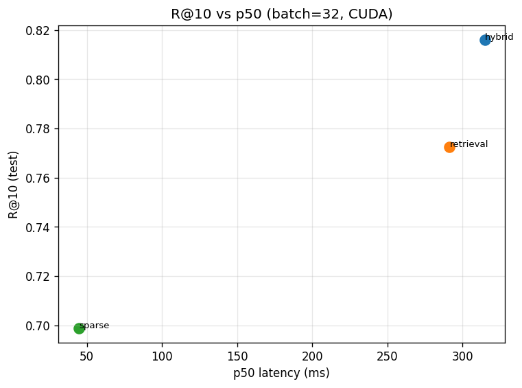

# Latency benchmark summary (TASK-034)

## Hardware fingerprint

- **Expanded:** `Intel64 Family 6 Model 151 Stepping 5, GenuineIntel|ram_gb=64|NVIDIA GeForce RTX 3060 Ti|vram_gb=8|cuda=12.1|torch=2.5.1+cu121|py=3.10.11`
- **hardware_id:** `b10e061452dfab7c`

- **Source CSV:** `reports\benchmarks\latency_full.csv`
- **Cold vs warm:** `reports\benchmarks\cold_vs_warm.csv`

- **Total wall time (grid):** 535.17 min
- **Rows in latency_full.csv:** 14
- **Strict CUDA cells (n>=1000):** 14
- **Strict CPU bs<=32 (n>=1000):** 0
- **Relaxed CPU large-batch rows (n<target):** 0
- **Cells with n_bench_actual < n_bench_target:** 0

## n_bench compliance (DECISION-054)

CUDA: target 1000+ per cell where CUDA ran. CPU batch<=32: 1000+ where feasible within max-cell-min. CPU batch 64/128: minimum 200 with optional reduction and notes.

## Pareto (batch=32, CUDA): quality vs latency (p50)

| family | p50_ms | p95_ms | throughput | R@10 test |
|---|---:|---:|---:|---:|
| sparse | 44.57 | 52.94 | 706.95 | 0.69890 |
| retrieval | 291.39 | 492.72 | 106.63 | 0.77252 |
| hybrid | 314.84 | 457.51 | 98.02 | 0.81612 |

## GPU OOM fallback ladder

- (none)
